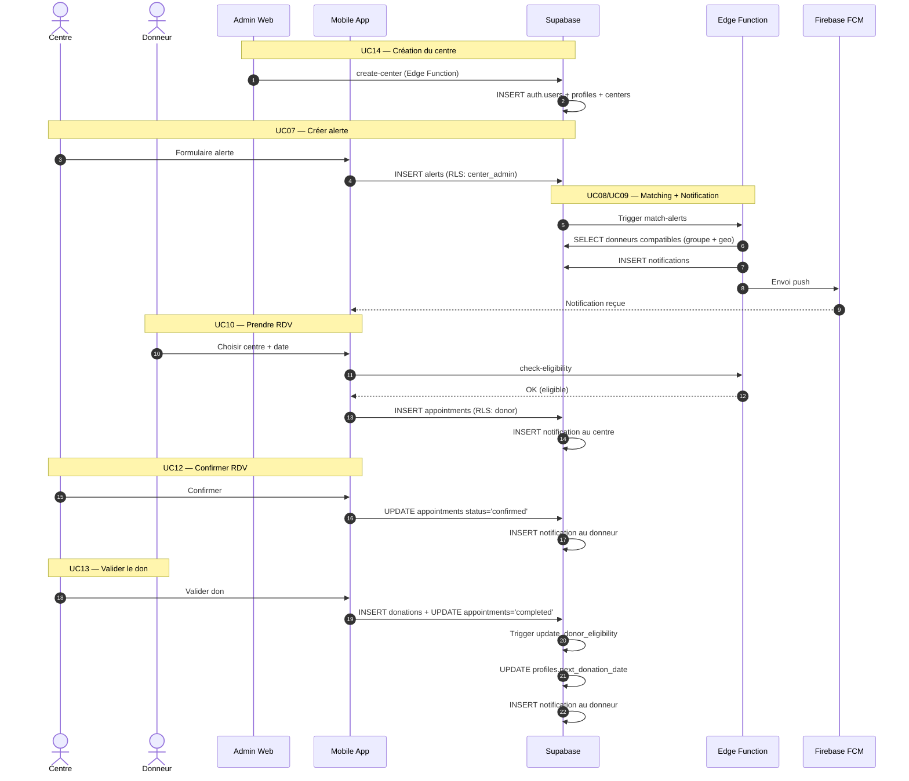
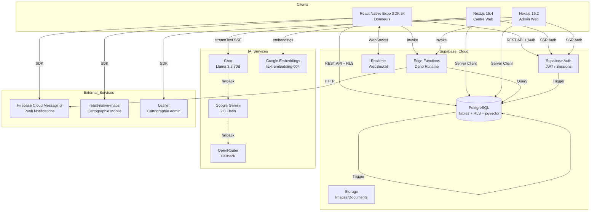
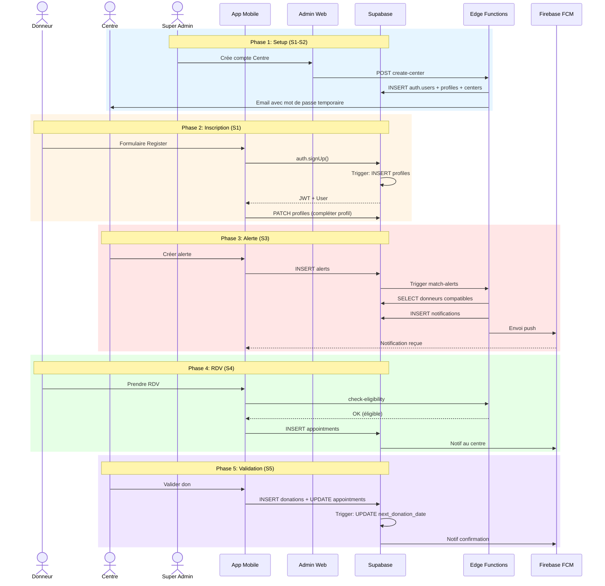

# Architecture Technique — BloodLink (Nouvelle Stack)

> Document d'architecture complète basé sur les use cases du MVP.  
> Stack : Supabase (Backend + DB + Auth) | React Native Expo (Mobile) | Next.js 15.4 (Centre Web) | Next.js 16.2 (Admin Web).

---

## 1. Vue d'ensemble

### 1.1. Stack retenue

| Couche | Technologie | Rôle |
|--------|-------------|------|
| **Base de données** | PostgreSQL (Supabase) | Stockage relationnel, géospatial (PostGIS), triggers, vector search (pgvector) |
| **Auth & Session** | Supabase Auth | Register, login, logout, JWT, reset password, email confirmation |
| **API** | Supabase REST + Edge Functions + Next.js API Routes | CRUD auto + logique métier + IA chat streaming |
| **Temps réel** | Supabase Realtime | Notifications in-app, mises à jour live |
| **Storage** | Supabase Storage | Images profil, avatars, documents |
| **Mobile** | React Native + Expo SDK 54 + NativeWind | App donneur (Tailwind CSS natif) |
| **Web Centre** | Next.js 15.4 + TypeScript + Tailwind 4 + shadcn/ui | Dashboard centre + IA SangBot |
| **Web Admin** | Next.js 16.2 + TypeScript + Tailwind 4 + shadcn/ui | Dashboard super_admin |
| **IA Chat** | Vercel AI SDK v6 + Groq (Llama 3.3 70B) | Assistant SangBot avec streaming SSE, tool calling, RAG |
| **Notifications push** | expo-notifications + Firebase FCM | Alertes ciblées sur mobile |
| **Cartographie mobile** | react-native-maps | Affichage des centres et alertes géolocalisées |
| **Cartographie admin** | Leaflet + react-leaflet | Carte centres dans admin |
| **i18n** | next-intl (fr/en/de/es) | Internationalisation centre web |
| **Animations** | Framer Motion + GSAP | Animations UI avancées |
| **Export** | jspdf + @react-pdf/renderer + exceljs | PDF et Excel |
| **QR Code** | react-native-qrcode-svg + jsQR + @zxing | Génération et scan QR |

### 1.2. Principes directeurs

- **Zero backend maison** : Supabase Auth gère 100 % de l'authentification. Pas d'endpoint `/auth/login` custom.
- **Sécurité par RLS** : chaque table a des `Row Level Security` policies. Aucune donnée n'est accessible sans policy explicite.
- **Données métier dans `profiles`** : `auth.users` est une boîte noire gérée par Supabase. Tout le métier est dans `profiles`.
- **Triggers SQL pour les règles métier** : `next_donation_date`, expiration d'alerte, création automatique de profil.
- **Edge Functions pour le matching** : logique complexe (compatibilité groupe sanguin + rayon géo) exécutée côté serveur.

---

## 2. Modèle de données

### 2.1. Tables

```
auth.users (géré par Supabase)
    └── FK 1:1 ──► profiles

profiles
    ├── role: donor          ──► (N) appointments
    │                          ──► (N) donations
    │                          ──► (N) notifications
    └── role: center_admin   ──► (1) centers

alerts
    └── FK N:1 ──► centers

appointments
    ├── FK N:1 ──► profiles (donor)
    └── FK N:1 ──► centers

donations
    ├── FK N:1 ──► profiles (donor)
    ├── FK N:1 ──► centers
    └── FK 0..1 ──► appointments

notifications
    └── FK N:1 ──► profiles
```

### 2.2. Enumérations

| Enum | Valeurs | Utilisation |
|------|---------|-------------|
| `user_role` | `donor`, `center_admin`, `super_admin` | `profiles.role` |
| `blood_type` | `A+`, `A-`, `B+`, `B-`, `AB+`, `AB-`, `O+`, `O-` | `profiles.blood_type`, `alerts.blood_type_required` |
| `urgency_level` | `low`, `medium`, `high`, `critical` | `alerts.urgency_level` |
| `alert_status` | `active`, `expired`, `closed` | `alerts.status` |
| `appointment_status` | `pending`, `confirmed`, `cancelled`, `completed` | `appointments.status` |
| `donation_status` | `pending`, `validated`, `rejected` | `donations.status` |
| `notification_type` | `alert`, `appointment`, `donation`, `system` | `notifications.type` |

### 2.3. Matrice de compatibilité groupe sanguin

| Donneur | Peut donner à |
|---------|---------------|
| `O-` | `A+`, `A-`, `B+`, `B-`, `AB+`, `AB-`, `O+`, `O-` (tous) |
| `O+` | `A+`, `B+`, `AB+`, `O+` |
| `A-` | `A+`, `A-`, `AB+`, `AB-` |
| `A+` | `A+`, `AB+` |
| `B-` | `B+`, `B-`, `AB+`, `AB-` |
| `B+` | `B+`, `AB+` |
| `AB-` | `AB+`, `AB-` |
| `AB+` | `AB+` |

---

## 3. Mapping Use Cases → Architecture

| UC | Nom | Acteur | Table(s) | RLS / Policy | Edge Function | Screen / Page |
|----|------|--------|----------|--------------|---------------|---------------|
| **UC01** | S'inscrire donneur | Donneur | `auth.users` + `profiles` | Trigger auto-insert `profiles` | — | `auth/register.tsx` |
| **UC02** | Se connecter | Tous | `auth.users` | Supabase Auth natif | — | `auth/login.tsx` / `admin/login.tsx` |
| **UC03** | Se déconnecter | Tous | `auth.users` | Supabase Auth natif | — | Hook `useAuth` |
| **UC04** | Gérer profil donneur | Donneur | `profiles` | `UPDATE WHERE id = auth.uid()` | — | `tabs/profile.tsx` |
| **UC05** | Gérer profil centre | Centre | `profiles` + `centers` | `UPDATE WHERE admin_id = auth.uid()` | — | Écran centre (Post-MVP) |
| **UC06** | Voir centres | Donneur | `centers` | `SELECT WHERE is_active = true` | — | `tabs/map.tsx` |
| **UC07** | Créer alerte | Centre | `alerts` | `INSERT WHERE center_id = mon_centre` | — | Écran centre |
| **UC08** | Voir alertes | Donneur | `alerts` | `SELECT WHERE status = 'active'` + matching | `match-alerts` | `tabs/index.tsx` |
| **UC09** | Recevoir notification | Donneur | `notifications` | `SELECT WHERE user_id = auth.uid()` | `send-push` | In-app + FCM |
| **UC10** | Prendre RDV | Donneur | `appointments` | `INSERT` avec vérification éligibilité | `check-eligibility` | Écran RDV |
| **UC11** | Voir mes RDV | Donneur / Centre | `appointments` | `SELECT WHERE donor_id = uid` ou `center_id = mon_centre` | — | `tabs/donations.tsx` |
| **UC12** | Confirmer/annuler RDV | Centre | `appointments` | `UPDATE WHERE center_id = mon_centre` | — | Écran centre |
| **UC13** | Valider un don | Centre | `donations` + `appointments` + `profiles` | `INSERT` + trigger MAJ éligibilité | — | Écran centre |
| **UC14** | Gérer comptes centre | Admin | `profiles` + `centers` | `super_admin` bypass RLS | `create-center` | `admin/centers/page.tsx` |
| **UC15** | Superviser | Admin | Toutes | `super_admin` bypass RLS | `admin-stats` | `admin/dashboard/page.tsx` |
| **UC16** | Chat SangBot | Donneur | `knowledge_base` + tools | JWT verify | — | `components/ai/ChatWidget.tsx` |
| **UC17** | Partager alerte | Donneur | `alert_shares` | `INSERT WHERE user_id = auth.uid()` | — | `app/share-alert.tsx` |
| **UC18** | Analytics partage | Donneur | `share_activities` | `SELECT WHERE user_id = auth.uid()` | — | `app/share-analytics.tsx` |
| **UC19** | Scanner QR donneur | Centre | `profiles` | Centre admin | — | `admin/scan-qr/page.tsx` |
| **UC20** | Exporter PDF | Centre/Admin | Toutes | Rôle centre_admin / super_admin | — | Feature center_web/admin_web |

---

## 4. Détail des tables

### 4.1. `profiles`

Extension métier de `auth.users`. Créée automatiquement par trigger à l'inscription.

| Champ | Type | Contraintes | Description |
|-------|------|-------------|-------------|
| `id` | UUID | PK, FK → `auth.users.id` | Identifiant (même que auth) |
| `full_name` | VARCHAR(200) | NOT NULL | Nom complet |
| `phone` | VARCHAR(20) | NOT NULL | Téléphone |
| `blood_type` | `blood_type` | NULLABLE | Groupe sanguin (donneur) |
| `date_of_birth` | DATE | NULLABLE | Date naissance |
| `weight_kg` | DECIMAL(5,2) | CHECK >= 50 | Poids (donneur) |
| `role` | `user_role` | NOT NULL, DEFAULT `donor` | Rôle |
| `is_active` | BOOLEAN | DEFAULT TRUE | Compte actif / suspendu |
| `next_donation_date` | DATE | NULLABLE | Prochain don possible |
| `fcm_token` | VARCHAR(255) | NULLABLE | Token push FCM |
| `latitude` | DECIMAL(10,8) | NULLABLE | Position GPS |
| `longitude` | DECIMAL(11,8) | NULLABLE | Position GPS |
| `created_at` | TIMESTAMPTZ | DEFAULT NOW() | Création |
| `updated_at` | TIMESTAMPTZ | DEFAULT NOW() | MAJ |

**RLS Policies :**
- `SELECT` : tout le monde peut voir `id`, `full_name`, `blood_type`, `role` des autres (nécessaire pour matching). Les données sensibles (phone, fcm_token) : `auth.uid() = id`.
- `UPDATE` : `auth.uid() = id` ET `is_active = true`.
- `DELETE` : `super_admin` uniquement.

### 4.2. `centers`

| Champ | Type | Contraintes | Description |
|-------|------|-------------|-------------|
| `id` | UUID | PK, DEFAULT gen_random_uuid() | Identifiant |
| `name` | VARCHAR(200) | NOT NULL | Nom du centre |
| `address` | TEXT | NOT NULL | Adresse |
| `city` | VARCHAR(100) | NOT NULL | Ville |
| `phone` | VARCHAR(20) | NOT NULL | Téléphone |
| `email` | VARCHAR(255) | NOT NULL | Email |
| `latitude` | DECIMAL(10,8) | NOT NULL | Latitude |
| `longitude` | DECIMAL(11,8) | NOT NULL | Longitude |
| `admin_id` | UUID | FK → `profiles.id`, UNIQUE | Admin lié à ce centre |
| `is_active` | BOOLEAN | DEFAULT TRUE | Actif |
| `created_at` | TIMESTAMPTZ | DEFAULT NOW() | Création |
| `updated_at` | TIMESTAMPTZ | DEFAULT NOW() | MAJ |

**RLS Policies :**
- `SELECT` : tout le monde (`is_active = true`).
- `INSERT` : `super_admin` uniquement (compte centre créé par admin).
- `UPDATE` : `auth.uid() = admin_id` (centre modifie son profil) OU `super_admin`.
- `DELETE` : `super_admin` uniquement.

### 4.3. `alerts`

| Champ | Type | Contraintes | Description |
|-------|------|-------------|-------------|
| `id` | UUID | PK | Identifiant |
| `center_id` | UUID | FK → `centers.id` | Centre émetteur |
| `blood_type_required` | `blood_type` | NOT NULL | Groupe demandé |
| `urgency_level` | `urgency_level` | NOT NULL | Urgence |
| `radius_km` | INTEGER | CHECK > 0 | Rayon de diffusion |
| `message` | TEXT | NULLABLE | Message |
| `deadline` | TIMESTAMPTZ | NOT NULL | Date limite |
| `status` | `alert_status` | DEFAULT `active` | État |
| `created_at` | TIMESTAMPTZ | DEFAULT NOW() | Création |
| `updated_at` | TIMESTAMPTZ | DEFAULT NOW() | MAJ |

**RLS Policies :**
- `SELECT` : tout le monde (`status = 'active'`).
- `INSERT` : `auth.uid()` doit être le `admin_id` du `center_id` (le centre crée ses alertes).
- `UPDATE` : même règle que `INSERT`.
- `DELETE` : `super_admin` ou `center_admin` lié.

**Trigger** : `expire_old_alerts()` — toutes les minutes, passe `status = 'expired'` si `deadline < NOW()`.

### 4.4. `appointments`

| Champ | Type | Contraintes | Description |
|-------|------|-------------|-------------|
| `id` | UUID | PK | Identifiant |
| `donor_id` | UUID | FK → `profiles.id` | Donneur |
| `center_id` | UUID | FK → `centers.id` | Centre |
| `alert_id` | UUID | FK → `alerts.id`, NULLABLE | Alerte liée (nullable) |
| `scheduled_date` | TIMESTAMPTZ | NOT NULL | Date/heure prévue |
| `status` | `appointment_status` | DEFAULT `pending` | État |
| `notes` | TEXT | NULLABLE | Notes |
| `created_at` | TIMESTAMPTZ | DEFAULT NOW() | Création |
| `updated_at` | TIMESTAMPTZ | DEFAULT NOW() | MAJ |

**RLS Policies :**
- `SELECT` : `auth.uid() = donor_id` (donneur voit ses RDV) OU `auth.uid() = centers.admin_id` (centre voit ses RDV entrants).
- `INSERT` : `auth.uid() = donor_id` ET éligibilité vérifiée (Edge Function ou check SQL).
- `UPDATE` : `auth.uid() = donor_id` (annulation par donneur) OU `auth.uid() = center_admin` (confirmation/annulation par centre).

### 4.5. `donations`

| Champ | Type | Contraintes | Description |
|-------|------|-------------|-------------|
| `id` | UUID | PK | Identifiant |
| `donor_id` | UUID | FK → `profiles.id` | Donneur |
| `center_id` | UUID | FK → `centers.id` | Centre |
| `appointment_id` | UUID | FK → `appointments.id`, NULLABLE | RDV associé |
| `donation_date` | TIMESTAMPTZ | NOT NULL | Date du don |
| `volume_ml` | INTEGER | DEFAULT 450 | Volume prélevé |
| `status` | `donation_status` | DEFAULT `pending` | État |
| `validated_by` | UUID | FK → `profiles.id` | Qui a validé |
| `validated_at` | TIMESTAMPTZ | NULLABLE | Quand |
| `notes` | TEXT | NULLABLE | Notes |
| `created_at` | TIMESTAMPTZ | DEFAULT NOW() | Création |

**RLS Policies :**
- `SELECT` : `auth.uid() = donor_id` (donneur voit ses dons) OU `auth.uid() = center_admin` (centre voit les dons de son centre).
- `INSERT` : `auth.uid() = center_admin` du centre (seul le centre crée un don).
- `UPDATE` : `auth.uid() = center_admin` ET `status` transition autorisée.

**Trigger** : `update_donor_eligibility()` — quand `status` passe à `validated`, met `profiles.next_donation_date = donation_date + 56 jours`.

### 4.6. `notifications`

| Champ | Type | Contraintes | Description |
|-------|------|-------------|-------------|
| `id` | UUID | PK | Identifiant |
| `user_id` | UUID | FK → `profiles.id` | Destinataire |
| `title` | VARCHAR(200) | NOT NULL | Titre |
| `body` | TEXT | NOT NULL | Contenu |
| `type` | `notification_type` | NOT NULL | Type |
| `is_read` | BOOLEAN | DEFAULT FALSE | Lue |
| `data` | JSONB | NULLABLE | Métadonnées (alert_id, appointment_id...) |
| `created_at` | TIMESTAMPTZ | DEFAULT NOW() | Création |
| `read_at` | TIMESTAMPTZ | NULLABLE | Date de lecture |

**RLS Policies :**
- `SELECT` : `auth.uid() = user_id`.
- `INSERT` : `super_admin` ou Edge Function (système).
- `UPDATE` : `auth.uid() = user_id` (marquer comme lue).

### 4.7. `alert_shares` 🆕

Liens de partage d'alertes avec codes courts et QR.

| Champ | Type | Contraintes | Description |
|-------|------|-------------|-------------|
| `id` | UUID | PK | Identifiant |
| `short_code` | VARCHAR(8) | UNIQUE NOT NULL | Code court pour URL |
| `original_url` | TEXT | NOT NULL | URL originale de l'alerte |
| `share_data` | JSONB | NOT NULL | Données de l'alerte partagée |
| `user_id` | UUID | FK → `auth.users.id` | Donneur qui partage |
| `expires_at` | TIMESTAMPTZ | NOT NULL | Expiration du lien |
| `click_count` | INTEGER | DEFAULT 0 | Nombre de clics |
| `conversion_count` | INTEGER | DEFAULT 0 | Nombre de conversions (prises de RDV) |
| `created_at` | TIMESTAMPTZ | DEFAULT NOW() | Création |

**RLS Policies :**
- `SELECT` : tout le monde (liens publics).
- `INSERT` : `auth.uid() = user_id`.
- `UPDATE` : `auth.uid() = user_id` (incrémentation compteurs).

### 4.8. `share_activities` 🆕

Tracking des interactions sur les liens de partage.

| Champ | Type | Contraintes | Description |
|-------|------|-------------|-------------|
| `id` | UUID | PK | Identifiant |
| `share_link_id` | VARCHAR(8) | FK → `alert_shares.short_code` | Lien source |
| `activity_type` | VARCHAR(20) | CHECK IN ('share','click','conversion') | Type d'activité |
| `platform` | VARCHAR(50) | NULLABLE | Plateforme (whatsapp, facebook, etc.) |
| `user_agent` | TEXT | NULLABLE | User agent |
| `ip_address` | INET | NULLABLE | IP visiteur |
| `created_at` | TIMESTAMPTZ | DEFAULT NOW() | Création |

### 4.9. `knowledge_base` 🆕

Base de connaissances vectorisée pour le RAG de SangBot.

| Champ | Type | Contraintes | Description |
|-------|------|-------------|-------------|
| `id` | UUID | PK | Identifiant |
| `content` | TEXT | NOT NULL | Texte de connaissance |
| `embedding` | VECTOR(768) | NOT NULL | Embedding vectoriel (Google text-embedding-004) |
| `category` | VARCHAR(100) | NULLABLE | Catégorie (éligibilité, effets, centres...) |
| `source` | VARCHAR(200) | NULLABLE | Source du contenu |
| `metadata` | JSONB | NULLABLE | Métadonnées additionnelles |

---

## 5. Triggers SQL

### 5.1. `handle_new_user()` — Création automatique de `profile`

```sql
CREATE OR REPLACE FUNCTION public.handle_new_user()
RETURNS TRIGGER AS $$
BEGIN
  INSERT INTO public.profiles (id, full_name, role, is_active)
  VALUES (
    NEW.id,
    COALESCE(NEW.raw_user_meta_data->>'full_name', 'Utilisateur'),
    'donor',
    TRUE
  );
  RETURN NEW;
END;
$$ LANGUAGE plpgsql SECURITY DEFINER;

CREATE TRIGGER on_auth_user_created
  AFTER INSERT ON auth.users
  FOR EACH ROW EXECUTE FUNCTION public.handle_new_user();
```

**Pourquoi** : chaque inscription Supabase crée un `auth.users`. Ce trigger crée automatiquement le `profile` associé avec `role = 'donor'`.

### 5.2. `expire_old_alerts()` — Expiration automatique

```sql
CREATE OR REPLACE FUNCTION public.expire_old_alerts()
RETURNS void AS $$
BEGIN
  UPDATE public.alerts
  SET status = 'expired'
  WHERE deadline < NOW() AND status = 'active';
END;
$$ LANGUAGE plpgsql;
```

**Scheduling** : Supabase Cron job ou Edge Function appelée toutes les 5 minutes.

### 5.3. `update_donor_eligibility()` — MAJ date prochain don

```sql
CREATE OR REPLACE FUNCTION public.update_donor_eligibility()
RETURNS TRIGGER AS $$
BEGIN
  IF NEW.status = 'validated' AND OLD.status != 'validated' THEN
    UPDATE public.profiles
    SET next_donation_date = NEW.donation_date + INTERVAL '56 days',
        updated_at = NOW()
    WHERE id = NEW.donor_id;
  END IF;
  RETURN NEW;
END;
$$ LANGUAGE plpgsql;

CREATE TRIGGER on_donation_validated
  AFTER UPDATE ON public.donations
  FOR EACH ROW EXECUTE FUNCTION public.update_donor_eligibility();
```

---

## 6. Edge Functions

| Fonction | Langage | Déclencheur | Description |
|----------|---------|-------------|-------------|
| `match-alerts` | TypeScript (Deno) | Appelée par client ou Cron | Reçoit `donor_id` + `position`, retourne alertes actives compatibles (groupe sanguin + rayon géo). |
| `check-eligibility` | TypeScript (Deno) | Avant création RDV | Vérifie `next_donation_date`, `is_active`, `weight_kg`, `age >= 18`. Retourne bool + message. |
| `send-push` | TypeScript (Deno) | Trigger ou Cron | Envoie FCM aux donneurs matchés. Utilise `profiles.fcm_token`. |
| `create-center` | TypeScript (Deno) | Appelée par admin web | Crée un compte `auth.users` + `profiles` (role=center_admin) + `centers`. Envoi email temp password. |
| `admin-stats` | TypeScript (Deno) | Appelée par admin web | Agrégations : nombre de dons ce mois, alertes actives, donneurs par groupe sanguin. |
| `get_nearby_centers` | SQL RPC | Appelée par chat tools | Centres proches d'une position (PostGIS). |
| `get_urgent_alerts` | SQL RPC | Appelée par chat tools | Alertes urgentes actives. |
| `match_knowledge` | SQL RPC | Appelée par RAG | Recherche vectorielle dans knowledge_base (pgvector). |

---

## 7. Flow d'authentification détaillé

### 7.1. Inscription donneur (UC01)

```
┌─────────────┐     ┌─────────────────┐     ┌─────────────┐     ┌─────────────┐
│   Mobile    │────►│  supabase.auth.   │────►│ auth.users  │────►│  profiles   │
│   Register  │     │  signUp()         │     │  (Supabase) │     │  (Trigger)  │
└─────────────┘     └─────────────────┘     └─────────────┘     └─────────────┘
       │                                                       │
       │◄──────────────── JWT + user ────────────────────────│
       │
       │► PATCH profiles (full_name, phone, blood_type, ...)
       │
       │◄──── OK
       │
       └─► Redirection Accueil
```

**Étapes :**
1. Donneur saisit email + password + `full_name` (métadonnées).
2. `supabase.auth.signUp({ email, password, options: { data: { full_name } } })`.
3. Supabase crée `auth.users`.
4. **Trigger** `on_auth_user_created` → crée `profile` avec `role = 'donor'`.
5. Client reçoit JWT.
6. Client fait `PATCH profiles` pour compléter `blood_type`, `phone`, etc.
7. Si `email confirmation` activé : l'utilisateur doit confirmer son email avant de pouvoir faire des requêtes.

### 7.2. Connexion (UC02)

```
Mobile/Admin ──► supabase.auth.signInWithPassword({ email, password })
                      │
                      ▼
              Vérification auth.users
                      │
                      ▼
              Vérification profiles.is_active = TRUE (RM09)
                      │
                      ▼
              JWT retourné ──► Stockage (SecureStore mobile / Cookie admin)
                      │
                      ▼
              Récupération profile.role
                      │
              donor ──► App mobile
              center_admin ──► Écran centre (ou admin web si implémenté)
              super_admin ──► Admin web (/admin/dashboard)
```

### 7.3. Création compte centre (UC14) — Par super_admin

```
Admin Web ──► Edge Function `create-center`
                  │
                  ▼
              Crée auth.users (email temp, password random)
              │
              ▼
              Trigger crée profile avec role = 'center_admin'
              │
              ▼
              Insère centers avec admin_id = nouveau profile.id
              │
              ▼
              Envoi email reset password au centre
```

**RM03 respectée** : le centre ne s'auto-inscrit pas.

---

## 8. Séquence : Scénario principal (Alerte → Don validé)



---

## 9. Screens Mobile (React Native / Expo Router)

| Route | Screen | Acteur | UC |
|-------|--------|--------|-----|
| `/(auth)/login` | `LoginScreen` | Tous | UC02 |
| `/(auth)/register` | `RegisterScreen` | Donneur | UC01 |
| `/(tabs)/` | `HomeScreen` (alertes) | Donneur | UC08 |
| `/(tabs)/map` | `MapScreen` | Donneur | UC06 |
| `/(tabs)/donations` | `AppointmentsScreen` | Donneur | UC11 |
| `/(tabs)/profile` | `ProfileScreen` | Donneur | UC04 |
| `/(tabs)/notifications` | `NotificationsScreen` | Donneur | UC09 |
| `/appointment/[id]` | `AppointmentDetailScreen` | Donneur | UC10 |
| `/alert/[id]` | `AlertDetailScreen` | Donneur | UC08 |

---

## 10. Pages Centre Web (Next.js 15.4) 🆕

| Route | Page | Rôle requis | UC |
|-------|------|-------------|-----|
| `/[locale]/login` | `LoginPage` | centre_admin | UC02 |
| `/[locale]/(dashboard)` | `DashboardPage` | centre_admin | UC07, UC12, UC13 |
| `/[locale]/(dashboard)/alerts` | `AlertsPage` | centre_admin | UC07 |
| `/[locale]/(dashboard)/appointments` | `AppointmentsPage` | centre_admin | UC11, UC12 |
| `/[locale]/(dashboard)/donations` | `DonationsPage` | centre_admin | UC13 |
| `/[locale]/(dashboard)/donors` | `DonorsPage` | centre_admin | UC13 |
| `/[locale]/(dashboard)/settings` | `SettingsPage` | centre_admin | UC05 |
| `/[locale]/terms` | `TermsPage` | public | — |
| `/api/chat` | `ChatAPI` (SSE) | JWT (donneur) | UC16 |

**i18n** : Toutes les routes sont préfixées par `[locale]` (fr, en, de, es) via `next-intl`.

**Middleware Next.js** : vérifie le `role` dans `profiles` avant d'autoriser l'accès à `/(dashboard)/*`.

---

## 10b. Pages Admin Web (Next.js 16.2)

| Route | Page | Rôle requis | UC |
|-------|------|-------------|-----|
| `/login` | `LoginPage` | Tous | UC02 |
| `/register` | `RegisterPage` | Tous | UC01 |
| `/reset-password` | `ResetPasswordPage` | Tous | — |
| `/admin/dashboard` | `DashboardPage` | `super_admin` | UC15 |
| `/admin/centers` | `CentersPage` | `super_admin` | UC14 |
| `/admin/donors` | `DonorsPage` | `super_admin` | UC15 |
| `/admin/appointments` | `AppointmentsPage` | `super_admin` | UC15 |
| `/admin/appointments-full` | `AppointmentsFullPage` | `super_admin` | UC15 |
| `/admin/donations` | `DonationsPage` | `super_admin` | UC15 |
| `/admin/alerts` | `AlertsPage` | `super_admin` | UC15 |
| `/admin/profiles` | `ProfilesPage` | `super_admin` | UC15 |
| `/admin/notifications` | `NotificationsPage` | `super_admin` | UC15 |
| `/admin/scan-qr` | `ScanQRPage` | `super_admin` | UC19 |
| `/admin/statistics` | `StatisticsPage` | `super_admin` | UC15 |
| `/admin/settings` | `SettingsPage` | `super_admin` | — |

**Middleware Next.js** : vérifie le `role` dans `profiles` avant d'autoriser l'accès à `/admin/*`.

---

## 11. Dépendances entre modules (Planning S1 → S6)

```
S1 — Auth + Setup
    ├── profiles (table + trigger)
    ├── auth screens (login, register)
    └── useAuth hook
         │
         ▼
S2 — Profils Donneur & Centre
    ├── CRUD profile mobile
    ├── centers table + seed
    └── admin: create-center
         │
         ▼
S3 — Alertes + Matching
    ├── alerts table
    ├── match-alerts Edge Function
    └── map screen
         │
         ▼
S4 — Rendez-vous + Notifications
    ├── appointments table
    ├── check-eligibility Edge Function
    ├── FCM setup
    └── push notifications
         │
         ▼
S5 — Validation Don + Admin
    ├── donations table
    ├── update_donor_eligibility trigger
    ├── admin dashboard
    └── admin stats Edge Function
         │
         ▼
S6 — Tests + Déploiement
    ├── End-to-end scenario
    ├── Build APK
    ├── Deploy admin (Vercel)
    └── Documentation finale
```

---

## 12. Règles métier → Implémentation

| Règle | Où implémentée | Comment |
|-------|---------------|---------|
| **RM01** (56 jours) | Trigger SQL | `update_donor_eligibility()` |
| **RM02** (18 ans, 50kg) | App mobile + Edge Function | Validation formulaire + `check-eligibility` |
| **RM03** (pas d'auto-inscription centre) | RLS + Edge Function | `INSERT centers` bloqué pour `donor` ; création via `create-center` |
| **RM04** (alerte date limite) | Trigger / Cron | `expire_old_alerts()` |
| **RM05** (matching groupe + geo + éligibilité) | Edge Function | `match-alerts` |
| **RM06** (RDV futur) | App mobile + CHECK SQL | `scheduled_date > NOW()` |
| **RM07** (seul centre valide) | RLS | `INSERT donations` : `auth.uid() = center.admin_id` |
| **RM08** (MAJ éligibilité) | Trigger SQL | `on_donation_validated` |
| **RM09** (suspendu = pas de connexion) | Hook `useAuth` | Vérifie `profiles.is_active` après login |
| **RM10** (hash bcrypt) | Supabase Auth | Natif |

---

## 13. Points de vigilance

1. **RLS sur `auth.users`** : `auth.users` est géré par Supabase. Ne jamais essayer d'y `INSERT` directement. Utiliser `supabase.auth.signUp()`.
2. **Email confirmation** : si activé, un donneur inscrit ne peut pas faire de requêtes avant d'avoir confirmé son email. Prévoir un écran "Vérifiez vos emails".
3. **PostGIS** : pour le matching géo, utiliser `ST_DWithin` ou `ST_Distance` avec `radius_km`. Installer l'extension `postgis` sur Supabase.
4. **FCM Token** : `fcm_token` change quand l'app est réinstallée. Mettre à jour à chaque lancement.
5. **Admin Web SSR** : Next.js doit utiliser `createServerClient` pour vérifier la session côté serveur avant de servir `/admin`.

---

## 14. Architecture Système Détaillée

### 14.1. Diagramme d'architecture complète



### 14.2. Flux de données - Inscription à Don



### 14.3. Diagramme de composants Mobile

```
┌─────────────────────────────────────────────────────────────┐
│                    React Native Expo                        │
├─────────────────────────────────────────────────────────────┤
│  ┌──────────────┐  ┌──────────────┐  ┌──────────────┐      │
│  │   Screens    │  │   Screens    │  │   Screens    │      │
│  │  (Auth)      │  │   (Tabs)     │  │  (Modal)     │      │
│  │              │  │              │  │              │      │
│  │ • Login      │  │ • Home       │  │ • Alert      │
│  │ • Register   │  │ • Map        │  │   Detail     │
│  │ • Verify OTP │  │ • Appointments│ │ • Appointment│
│  │              │  │ • Profile    │  │   Booking    │
│  └──────┬───────┘  │ • Notifs     │  │ • Share      │
│         │          └──────┬───────┘  │   Alert      │
│         │                 │          │ • Analytics  │
│         │                 │          └──────┬───────┘      │
│         │          └──────┬───────┘         │              │
│         │                 │                 │              │
│         └─────────────────┴─────────────────┘              │
│                           │                                │
│                    ┌──────┴──────┐                         │
│                    │  Navigation │                         │
│                    │ Expo Router │                         │
│                    └──────┬──────┘                         │
│                           │                                │
│         ┌─────────────────┼─────────────────┐             │
│         │                 │                 │             │
│  ┌──────▼──────┐  ┌──────▼──────┐  ┌──────▼──────┐      │
│  │    Hooks    │  │   Services  │  │    Stores   │      │
│  │             │  │             │  │             │      │
│  │ • useAuth   │  │ • supabase  │  │ authStore   │      │
│  │ • useProfile│  │ • fcm       │  │ alertStore  │      │
│  │ • useAlerts │  │ • location  │  │ apptStore   │      │
│  │ • useLocation│ │ • matching  │  │             │      │
│  └─────────────┘  └─────────────┘  └─────────────┘      │
└─────────────────────────────────────────────────────────────┘
```

---

## 15. Sécurité Complète

### 15.1. Modèle de sécurité en couches

| Couche | Mécanisme | Responsabilité |
|--------|-----------|----------------|
| **Client** | Input validation, HTTPS only | Prévenir les erreurs utilisateur |
| **Auth** | JWT (RS256), Refresh tokens | Authentifier l'utilisateur |
| **RLS** | Policies SQL | Filtrer les données par utilisateur |
| **DB** | Constraints, CHECK, FK | Intégrité des données |
| **Network** | SSL/TLS, CORS | Transport sécurisé |
| **Infra** | Supabase managed | DDoS, patching, backups |

### 15.2. Gestion des secrets

**Variables d'environnement requises :**

```bash
# Mobile (.env - jamais commit)
EXPO_PUBLIC_SUPABASE_URL=https://xxxx.supabase.co
EXPO_PUBLIC_SUPABASE_ANON_KEY=eyJ...

# Center Web (.env.local)
NEXT_PUBLIC_SUPABASE_URL=https://xxxx.supabase.co
NEXT_PUBLIC_SUPABASE_ANON_KEY=eyJ...
SUPABASE_SERVICE_ROLE_KEY=eyJ...  # Server-side only
GROQ_API_KEY=gsk_...              # IA Chat primary
GOOGLE_GENERATIVE_AI_API_KEY=AIza...  # IA Chat secondary + embeddings
OPENROUTER_API_KEY=sk-or-...      # IA Chat fallback
NEXT_PUBLIC_APP_URL=https://bloodlink.ma

# Admin Web (.env.local)
NEXT_PUBLIC_SUPABASE_URL=https://xxxx.supabase.co
NEXT_PUBLIC_SUPABASE_ANON_KEY=eyJ...
SUPABASE_SERVICE_ROLE_KEY=eyJ...  # Server-side only

# Edge Functions (.env pour CLI)
SUPABASE_ACCESS_TOKEN=sbp_...
FCM_SERVER_KEY=AAAA...  # Pour push notifications
```

**Règles de sécurité des secrets :**
- ✅ `.env.local` dans `.gitignore`
- ✅ JAMAIS de secrets dans le code source
- ✅ Service Role Key UNIQUEMENT dans Edge Functions ou SSR
- ✅ Rotation des clés tous les 90 jours
- ✅ Différentes clés par environnement (dev/staging/prod)

### 15.3. RLS Policies - Matrice complète

```
                    │ SELECT │ INSERT │ UPDATE │ DELETE │
────────────────────┼────────┼────────┼────────┼────────┤
profiles            │        │        │        │        │
  - Public data     │   ✅   │   ❌   │   ❌   │   ❌   │
  - Own profile     │   ✅   │   ❌   │   ✅   │   ❌   │
  - Super admin     │   ✅   │   ❌   │   ✅   │   ✅   │
────────────────────┼────────┼────────┼────────┼────────┤
centers             │        │        │        │        │
  - Active centers  │   ✅   │   ❌   │   ❌   │   ❌   │
  - Own center      │   ✅   │   ❌   │   ✅   │   ❌   │
  - Super admin     │   ✅   │   ✅   │   ✅   │   ✅   │
────────────────────┼────────┼────────┼────────┼────────┤
alerts              │        │        │        │        │
  - Active alerts   │   ✅   │   ❌   │   ❌   │   ❌   │
  - Own center      │   ✅   │   ✅   │   ✅   │   ✅   │
  - Super admin     │   ✅   │   ✅   │   ✅   │   ✅   │
────────────────────┼────────┼────────┼────────┼────────┤
appointments        │        │        │        │        │
  - Donor view      │   ✅   │   ✅   │   ✅   │   ❌   │
  - Center view     │   ✅   │   ❌   │   ✅   │   ❌   │
  - Super admin     │   ✅   │   ❌   │   ❌   │   ❌   │
────────────────────┼────────┼────────┼────────┼────────┤
donations           │        │        │        │        │
  - Donor view      │   ✅   │   ❌   │   ❌   │   ❌   │
  - Center manage   │   ✅   │   ✅   │   ✅   │   ❌   │
  - Super admin     │   ✅   │   ❌   │   ❌   │   ❌   │
────────────────────┼────────┼────────┼────────┼────────┤
alert_shares 🆕    │        │        │        │        │
  - Public links   │   ✅   │   ❌   │   ❌   │   ❌   │
  - Own shares     │   ✅   │   ✅   │   ✅   │   ❌   │
────────────────────┼────────┼────────┼────────┼────────┤
knowledge_base 🆕  │        │        │        │        │
  - System only    │   ❌   │   ✅   │   ✅   │   ✅   │
  (service_role)   │        │        │        │        │
```

### 15.4. Validation des données

**Côté Client (UX)** : Validation rapide pour feedback immédiat
```typescript
// Zod schema exemple
const DonorRegistrationSchema = z.object({
  email: z.string().email('Email invalide'),
  password: z.string().min(8, '8 caractères minimum'),
  full_name: z.string().min(2, 'Nom requis'),
  date_of_birth: z.string().refine((date) => {
    const age = differenceInYears(new Date(), new Date(date));
    return age >= 18;
  }, 'Vous devez avoir 18 ans minimum'),
  weight_kg: z.number().min(50, '50kg minimum requis'),
  blood_type: z.enum(['A+', 'A-', 'B+', 'B-', 'AB+', 'AB-', 'O+', 'O-'])
});
```

**Côté Serveur (Sécurité)** : Validation finale dans Edge Functions
```typescript
// Edge Function check-eligibility
if (donor.weight_kg < 50) {
  return new Response(
    JSON.stringify({ error: 'RM02: Poids insuffisant' }), 
    { status: 403 }
  );
}
```

**Côté Base (Intégrité)** : CHECK constraints SQL
```sql
CHECK (weight_kg >= 50 OR weight_kg IS NULL)
CHECK (scheduled_date > NOW())
CHECK (radius_km > 0)
```

---

## 16. Edge Functions - Spécifications Complètes

### 16.1. Liste des Edge Functions

| Function | Méthode | Input | Output | Auth Requise |
|----------|---------|-------|--------|--------------|
| `match-alerts` | POST | `{ donor_id, lat, lng }` | `{ alerts: Alert[] }` | ✅ JWT |
| `check-eligibility` | POST | `{ donor_id, scheduled_date }` | `{ eligible: boolean, reason?: string }` | ✅ JWT |
| `create-center` | POST | `{ email, name, address, ... }` | `{ center_id, temp_password }` | ✅ super_admin |
| `send-push` | POST | `{ user_ids, title, body }` | `{ sent: number }` | ✅ service_role |
| `admin-stats` | GET | Query params | `{ donors, donations, alerts, centers }` | ✅ super_admin |
| `expire-alerts` | GET | - | `{ expired: number }` | ✅ service_role (Cron) |

### 16.2. Signature détaillée

#### `match-alerts`
```typescript
// Request
interface MatchAlertsRequest {
  donor_id: string;      // UUID du donneur
  latitude: number;      // Position actuelle
  longitude: number;     // Position actuelle
  max_distance?: number;   // Filtre optionnel (km)
}

// Response
interface MatchAlertsResponse {
  success: boolean;
  alerts: Array<{
    id: string;
    center: {
      name: string;
      distance_km: number;
    };
    blood_type_required: string;
    urgency_level: 'low' | 'medium' | 'high' | 'critical';
    deadline: string;
    message?: string;
  }>;
  total: number;
}

// Erreurs
// 401: JWT invalide
// 403: Donneur non éligible (next_donation_date)
// 404: Donneur non trouvé
```

#### `check-eligibility`
```typescript
// Request
interface CheckEligibilityRequest {
  donor_id: string;
  center_id: string;
  scheduled_date: string; // ISO 8601
}

// Response Success
interface EligibleResponse {
  eligible: true;
  donor: {
    id: string;
    full_name: string;
    blood_type: string;
    next_donation_date: string | null;
  };
}

// Response Error
interface IneligibleResponse {
  eligible: false;
  reason: string;        // Message explicable
  code: 'RM01' | 'RM02' | 'RM09'; // Code règle métier
  next_donation_date?: string; // Si RM01
}
```

#### `create-center`
```typescript
// Request
interface CreateCenterRequest {
  email: string;
  full_name: string;     // Nom de l'admin centre
  phone: string;
  center: {
    name: string;
    address: string;
    city: string;
    latitude: number;
    longitude: number;
  };
}

// Response
interface CreateCenterResponse {
  center_id: string;
  admin_id: string;
  temp_password: string; // Mot de passe temporaire
  email_sent: boolean;
}
```

### 16.3. Template Edge Function

```typescript
// supabase/functions/match-alerts/index.ts
import { createClient } from 'jsr:@supabase/supabase-js@2';

const corsHeaders = {
  'Access-Control-Allow-Origin': '*',
  'Access-Control-Allow-Headers': 'authorization, x-client-info, apikey, content-type',
};

Deno.serve(async (req) => {
  // CORS preflight
  if (req.method === 'OPTIONS') {
    return new Response('ok', { headers: corsHeaders });
  }

  try {
    // Créer client Supabase avec la requête
    const supabaseClient = createClient(
      Deno.env.get('SUPABASE_URL')!,
      Deno.env.get('SUPABASE_ANON_KEY')!,
      {
        global: {
          headers: { Authorization: req.headers.get('Authorization')! },
        },
      }
    );

    // Vérifier l'utilisateur
    const { data: { user }, error: authError } = await supabaseClient.auth.getUser();
    if (authError || !user) {
      return new Response(JSON.stringify({ error: 'Unauthorized' }), {
        status: 401,
        headers: { ...corsHeaders, 'Content-Type': 'application/json' },
      });
    }

    // Logique métier ici
    const { donor_id, latitude, longitude } = await req.json();
    
    // ... requêtes SQL ...

    return new Response(JSON.stringify({ success: true, alerts: [] }), {
      headers: { ...corsHeaders, 'Content-Type': 'application/json' },
    });

  } catch (error) {
    return new Response(JSON.stringify({ error: error.message }), {
      status: 500,
      headers: { ...corsHeaders, 'Content-Type': 'application/json' },
    });
  }
});
```

---

## 16b. Architecture IA Chat — SangBot 🆕

### 16b.1. Vue d'ensemble

SangBot est l'assistant conversationnel BloodLink intégré dans l'app mobile. Il utilise le Vercel AI SDK v6 avec streaming SSE, tool calling, et RAG (Retrieval-Augmented Generation).

### 16b.2. Flux de données

```
Mobile (useChat.ts)
  │
  ├── POST /api/chat { messages, accessToken }
  │
  ▼
center_web API Route (route.ts)
  ├── 1. JWT verify (accessToken → Supabase Auth)
  ├── 2. Fetch user context (profile: name, blood_type, next_donation_date)
  ├── 3. RAG search (query → Google embedding → match_knowledge RPC, 5s timeout)
  ├── 4. Build system prompt (base + user context + RAG context)
  ├── 5. streamText() avec Groq/Gemini/OpenRouter
  │     ├── tools: getNearbyCenters, getUrgentAlerts
  │     ├── stopWhen: stepCountIs(5)
  │     ├── maxOutputTokens: 800
  │     └── temperature: 0.7
  └── 6. SSE stream → Mobile
        ├── onChunk: tokens progressifs
        └── onStepFinish: tool call results
```

### 16b.3. Composants

| Composant | Chemin | Rôle |
|-----------|--------|------|
| **API Route** | `center_web/src/app/api/chat/route.ts` | Point d'entrée SSE, auth JWT, RAG, streamText |
| **Modèles** | `center_web/src/features/ai/lib/models.ts` | Sélection provider (Groq > Gemini > OpenRouter) |
| **Prompts** | `center_web/src/features/ai/lib/prompts.ts` | System prompt SangBot, contexte utilisateur |
| **RAG** | `center_web/src/features/ai/lib/rag.ts` | Google text-embedding-004 + Supabase match_knowledge |
| **Tools** | `center_web/src/features/ai/lib/tools.ts` | `getNearbyCenters`, `getUrgentAlerts` |
| **useChat** | `mobile_app/components/ai/useChat.ts` | Hook SSE parsing, state, abort, erreurs |
| **ChatDrawer** | `mobile_app/components/ai/ChatDrawer.tsx` | Drawer modal, liste messages, suggestions |
| **ChatInput** | `mobile_app/components/ai/ChatInput.tsx` | Input texte, bouton envoi, bouton stop |
| **ChatMessage** | `mobile_app/components/ai/ChatMessage.tsx` | Bulles user/assistant, avatar |
| **ChatWidget** | `mobile_app/components/ai/ChatWidget.tsx` | Bouton flottant, ouverture drawer |

### 16b.4. Modèles IA (fallback chain)

| Priorité | Provider | Modèle | Quota gratuit | Caractéristiques |
|----------|----------|--------|---------------|------------------|
| 1 | **Groq** | llama-3.3-70b-versatile | 14400 req/jour | Ultra rapide, bon en français, tool calling |
| 2 | **Google Gemini** | gemini-2.0-flash | 1500 req/jour | Rapide, multilingue |
| 3 | **OpenRouter** | nvidia/nemotron-3-super-120b-a12b:free | Limité | Fallback ultime |

### 16b.5. RAG (Retrieval-Augmented Generation)

- **Embeddings** : Google `text-embedding-004` (768 dimensions)
- **Stockage** : Supabase `knowledge_base` table avec `pgvector`
- **Recherche** : RPC `match_knowledge(query_embedding, match_threshold, match_count)`
- **Timeout** : 5 secondes max (Promise.race)
- **Graceful degradation** : Si pas de clé embedding, RAG désactivé silencieusement

### 16b.6. Sécurité

- **Auth** : JWT vérifié via Supabase Auth sur chaque requête `/api/chat`
- **Pas de Service Role Key** dans le mobile — utilisation du JWT utilisateur
- **Rate limiting** : Vercel KV pour limiter les requêtes par utilisateur
- **Sanitisation** : Les erreurs API sont nettoyées avant envoi au client (pas de leak de clés)

---

## 17. Gestion des Erreurs

### 17.1. Codes HTTP et erreurs métier

| Code | Usage | Exemples |
|------|-------|----------|
| **200** | Success | GET, PATCH réussi |
| **201** | Created | INSERT réussi |
| **400** | Bad Request | Données invalides, validation échouée |
| **401** | Unauthorized | JWT manquant ou invalide |
| **403** | Forbidden | RLS bloque l'accès, règle métier violée (RM01-RM10) |
| **404** | Not Found | Ressource inexistante |
| **409** | Conflict | Email déjà utilisé, contrainte unique |
| **422** | Unprocessable | Format correct mais logique impossible |
| **429** | Rate Limit | Trop de requêtes |
| **500** | Server Error | Erreur serveur inattendue |

### 17.2. Format d'erreur standard

```typescript
interface AppError {
  code: string;           // Code machine (ex: 'AUTH_INVALID_CREDENTIALS')
  message: string;        // Message humain
  details?: unknown;      // Données contextuelles
  rule?: 'RM01' | 'RM02' | 'RM03' | 'RM04' | 'RM05' | 'RM06' | 'RM07' | 'RM08' | 'RM09' | 'RM10';
}

// Exemples
{
  "code": "ELIGIBILITY_INSUFFICIENT_WEIGHT",
  "message": "Vous devez peser au minimum 50kg pour donner du sang",
  "rule": "RM02"
}

{
  "code": "ELIGIBILITY_COOLING_PERIOD",
  "message": "Vous devez attendre 56 jours entre deux dons",
  "rule": "RM01",
  "details": {
    "next_donation_date": "2026-06-15",
    "days_remaining": 14
  }
}
```

### 17.3. Gestion côté client

```typescript
// Hook useErrorHandler
const useErrorHandler = () => {
  const handleError = (error: AppError) => {
    switch (error.code) {
      case 'AUTH_INVALID_CREDENTIALS':
        Alert.alert('Erreur', 'Email ou mot de passe incorrect');
        break;
      case 'ELIGIBILITY_INSUFFICIENT_WEIGHT':
        Alert.alert('Non éligible', error.message);
        break;
      case 'ELIGIBILITY_COOLING_PERIOD':
        Alert.alert(
          'Patience...',
          `Prochain don possible le ${formatDate(error.details.next_donation_date)}`
        );
        break;
      case 'RLS_POLICY_VIOLATION':
        Alert.alert('Accès refusé', 'Vous n\'avez pas les permissions nécessaires');
        break;
      default:
        Alert.alert('Erreur', error.message || 'Une erreur est survenue');
    }
  };

  return { handleError };
};
```

---

## 18. Performance & Scalabilité

### 18.1. Stratégies de performance

| Technique | Où | Impact |
|-----------|-----|--------|
| **Indexes** | SQL | Requêtes 10-100x plus rapides |
| **Pagination** | Listes | Limite la charge réseau |
| **Debouncing** | Search inputs | Réduit les requêtes API |
| **Optimistic UI** | Mutations | Réactivité perçue |
| **React Query** | Data fetching | Cache, stale-while-revalidate |
| **Image optimization** | Photos profil | Temps de chargement |
| **Edge Functions** | Calculs lourds | Réduit charge DB |

### 18.2. Pagination standard

```typescript
// Requête paginée
const PAGE_SIZE = 20;

const { data, fetchNextPage, hasNextPage } = useInfiniteQuery({
  queryKey: ['alerts'],
  queryFn: async ({ pageParam = 0 }) => {
    const { data, error } = await supabase
      .from('alerts')
      .select('*')
      .eq('status', 'active')
      .order('created_at', { ascending: false })
      .range(pageParam * PAGE_SIZE, (pageParam + 1) * PAGE_SIZE - 1);
    
    return { data, nextPage: pageParam + 1 };
  },
  getNextPageParam: (lastPage) => lastPage.nextPage,
});
```

### 18.3. Seuils et limites

| Ressource | Limite | Action si dépassé |
|-----------|--------|-------------------|
| Requêtes API | 100/min/client | Rate limit avec retry |
| Taille payload | 6 MB | Refuser avec 413 |
| Upload images | 5 MB | Compression côté client |
| Temps requête | 10s | Timeout + message |
| Edge Function | 50ms/400ms/2s | Optimiser ou découper |

### 18.4. Scalabilité anticipée

**Phase 1 (MVP - 1000 users)** :
- Supabase free tier suffisant
- Aucune optimisation critique

**Phase 2 (1000-10000 users)** :
- Connection pooling
- Read replicas si lecture intensive
- CDN pour images

**Phase 3 (10000+ users)** :
- Sharding par région géo
- Cache Redis pour matching fréquent
- Edge Functions sur plus de régions

---

## 19. Stratégie de Déploiement

### 19.1. Environnements

| Environnement | URL | Base de données | Usage |
|---------------|-----|-----------------|-------|
| **Local** | `http://localhost:8081` (mobile) / `:3000` (centre) / `:3001` (admin)` | Local/Supabase dev | Développement quotidien |
| **Staging** | `https://bloodlink-staging.vercel.app` | Supabase staging | Tests QA, démo |
| **Production** | `https://bloodlink.vercel.app` | Supabase prod | Live users |

### 19.2. Workflow Git

```
feature/uc01-auth ─┐
                   ├─► dev ─► staging ─► main ─► production
feature/uc02-profile ┘
```

**Règles de branche :**
- `feature/*` : Une branche par use case
- `dev` : Intégration continue, tests automatisés
- `staging` : Tests manuels, review client
- `main` : Production, déploiement automatique

### 19.3. Pipeline de déploiement

```yaml
# Pseudo-pipeline CI/CD
stages:
  - test:
      run: npm test
  
  - lint:
      run: npm run lint
  
  - db-migrate:
      if: branch == 'main'
      run: supabase db push
  
  - deploy-edge-functions:
      if: branch == 'main'
      run: supabase functions deploy
  
  - deploy-mobile:
      if: branch == 'main'
      run: eas build --platform android
  
  - deploy-admin:
      if: branch == 'main'
      run: vercel --prod
```

### 19.4. Checklist pre-deployment

- [ ] Tous les tests passent
- [ ] Migration DB testée sur staging
- [ ] RLS policies vérifiées
- [ ] Secrets configurés dans Vercel/Expo
- [ ] Rollback plan défini
- [ ] Monitoring activé (Sentry, Logflare)

---

## 20. Anti-Patterns à Éviter

### 20.1. Sécurité

| ❌ Anti-Pattern | ✅ Bonne pratique | Pourquoi |
|-----------------|-------------------|----------|
| Service Role Key dans le mobile | Anon Key + RLS | La Service Key bypass toute sécurité |
| Secrets hardcodés | Variables d'env | Risque de fuite sur GitHub |
| `SELECT *` | `SELECT colonnes_nécessaires` | Moins de données exposées |
| Désactiver RLS pour debug | Utiliser `supabase.auth.admin()` | RLS est la sécurité principale |

### 20.2. Performance

| ❌ Anti-Pattern | ✅ Bonne pratique | Pourquoi |
|-----------------|-------------------|----------|
| N+1 queries | JOINs ou React Query cache | Évite requêtes en cascade |
| Pas de pagination | `range()` + infinite scroll | Charge infinie = crash |
| Images non optimisées | `expo-image` avec resizing | Bande passante, mémoire |
| Calculs lourds côté client | Edge Functions | Réduit batterie, augmente sécurité |

### 20.3. Architecture

| ❌ Anti-Pattern | ✅ Bonne pratique | Pourquoi |
|-----------------|-------------------|----------|
| Logique métier dans les composants | Custom hooks + services | Testable, réutilisable |
| State global partout | Props drilling → Context → Zustand | Complexité croissante |
| Pas de types TypeScript | Types stricts | Bug détectés à la compilation |
| Inline styles | StyleSheet / Tailwind | Performance, maintenance |

---

## 21. Checklist Revue de Code

### 21.1. Avant chaque PR

**Sécurité :**
- [ ] Pas de secrets dans le code
- [ ] RLS policies vérifient bien le `auth.uid()`
- [ ] Pas de `console.log` avec données sensibles
- [ ] Validation côté client ET serveur

**Performance :**
- [ ] Pas de re-render inutile (memo, callback)
- [ ] Requêtes paginées si liste
- [ ] Images optimisées
- [ ] Pas de boucles imbriquées O(n²)

**Qualité :**
- [ ] Types TypeScript complets
- [ ] Fonctions < 50 lignes
- [ ] Nommage explicite (pas de `data`, `item`)
- [ ] Tests pour la logique métier

### 21.2. Template PR

```markdown
## Description
Résout UC01 - Inscription donneur

## Changements
- Ajout écrans Register/Login
- Hook useAuth avec gestion session
- Intégration Supabase Auth

## Tests
- [ ] Testé sur Android physique
- [ ] Testé sur simulateur iOS
- [ ] Email confirmation fonctionne

## Screenshots
[Ajouter screenshots]

## Checklist
- [ ] Pas de secrets exposés
- [ ] RLS policies OK
- [ ] Types complets
```

---

## 22. Guide de Dépannage

### 22.1. Problèmes courants

| Symptôme | Cause probable | Solution |
|----------|--------------|----------|
| `401 Unauthorized` | JWT expiré | Refresh token ou re-login |
| `403 RLS violation` | Policy incorrecte | Vérifier la policy, utiliser `auth.uid()` |
| `postgrest error` | Syntaxe SQL | Vérifier nom de table/colonne |
| Realtime ne marche pas | Pas de policy SELECT | Ajouter policy SELECT sur la table |
| Push notifs ne marchent pas | FCM token invalide | Rafraîchir token, vérifier clé serveur |
| Lent sur mobile | Pas de pagination | Ajouter `range()` à la requête |

### 22.2. Debugging Supabase

```typescript
// Activer logs détaillés
supabase.auth.onAuthStateChange((event, session) => {
  console.log('Auth event:', event, session);
});

// Vérifier RLS
const { data, error } = await supabase
  .from('profiles')
  .select('*')
  .eq('id', userId);

if (error) {
  console.error('RLS Debug:', {
    code: error.code,
    message: error.message,
    hint: error.hint,
  });
}
```

### 22.3. Logs importants

| Où | URL | Quand l'utiliser |
|----|-----|-----------------|
| Supabase Logs | Dashboard > Logs | Erreurs DB, Auth |
| Edge Function Logs | Dashboard > Edge Functions | Debug functions |
| Vercel Logs | Vercel Dashboard | Erreurs SSR admin |
| Sentry | sentry.io | Crash production |
| Expo Dashboard | expo.dev | Build, analytics |

---

## 23. Commandes Utiles

### 23.1. Supabase CLI

```bash
# Login
supabase login

# Lier le projet
supabase link --project-ref xgdinqpxjywlfhjylktu

# Lancer localement
supabase start

# Push les migrations
supabase db push

# Reset la DB locale
supabase db reset

# Nouvelle migration
supabase migration new add_notifications_table

# Déployer Edge Function
supabase functions deploy match-alerts

# Logs Edge Function
supabase functions logs match-alerts --tail
```

### 23.2. Expo

```bash
# Démarrer
npx expo start

# Build preview
eas build --platform android --profile preview

# Build production
eas build --platform android --profile production

# Submit to Play Store
eas submit --platform android
```

### 23.3. Next.js / Vercel

```bash
# Dev
npm run dev

# Build local
npm run build

# Deploy preview
vercel

# Deploy production
vercel --prod
```

---

*Document version 2.1 — BloodLink Architecture Complète.*  
*Dernière mise à jour: 2026-05-12*
