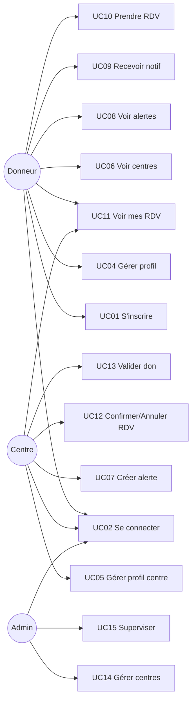
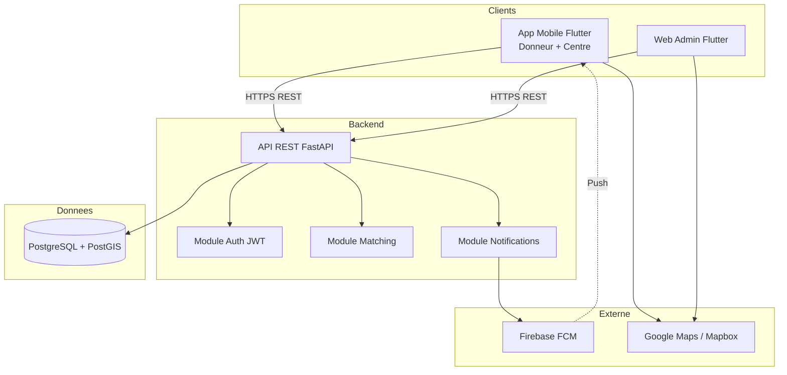
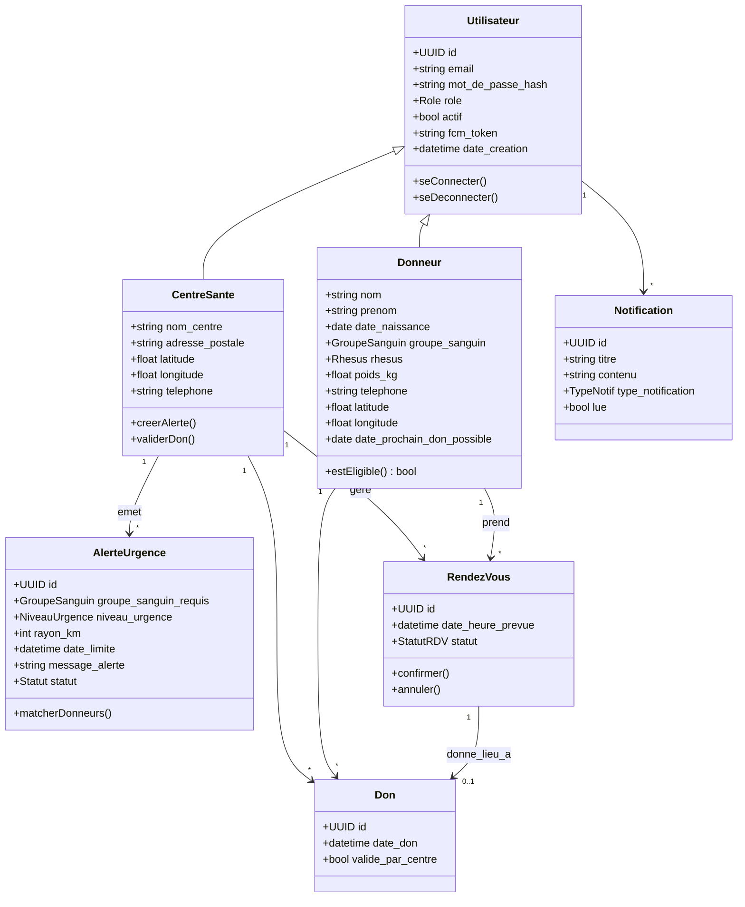
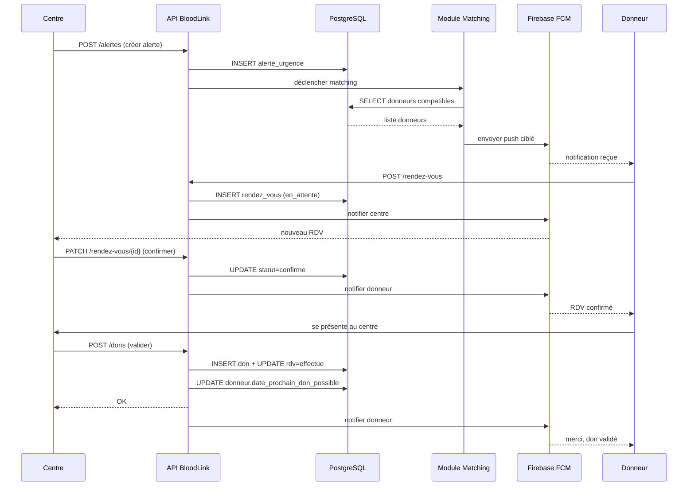

# Cahier des Charges — Projet BloodLink (MVP)

> Application de mise en relation entre donneurs de sang et centres de dons.

---

## 1. Informations générales

| Rubrique | Détail |
|---|---|
| **Nom du projet** | BloodLink |
| **Type** | Application mobile (donneur / centre) + interface web (administration) |
| **Durée** | 6 semaines (1,5 mois) |
| **Rythme de travail** | 3 jours par semaine |
| **Mode de travail** | Collaboratif — toute l'équipe travaille ensemble sur chaque module, aucun rôle figé (pas de séparation front/back). On finit un module, on passe au suivant. |
| **Livrable principal** | MVP fonctionnel, déployable et démontrable |

### 1.1. Équipe

| # | Nom complet |
|---|---|
| 1 | Somali Nathananel Edudzi |
| 2 | Beni Ouendo |
| 3 | Fatoumata Sidibé |
| 4 | Assia AZ |
| 5 | Souhaila Omri |

---

## 2. Contexte et problématique

Le don de sang souffre de plusieurs problèmes concrets :

- **Manque d'information en temps réel** pour les donneurs sur les besoins urgents
- **Difficulté pour les centres** à mobiliser rapidement des donneurs compatibles
- **Absence de canal direct** entre un centre qui a un besoin précis et les donneurs capables d'y répondre
- **Processus de rendez-vous souvent manuel**, peu structuré

`BloodLink` répond à cela en proposant une plateforme numérique qui met en relation directement :

- les **donneurs**
- les **centres de santé**
- via un **système d'alertes ciblées, de rendez-vous et de suivi des dons**

---

## 3. Objectifs du MVP

### 3.1. Objectif général

Livrer en 6 semaines une **première version fonctionnelle** de `BloodLink` qui couvre le **scénario principal complet** :

> Un centre lance une alerte → le système trouve les donneurs compatibles → le donneur est notifié → il prend rendez-vous → le centre confirme → le don est validé → le profil du donneur est mis à jour.

### 3.2. Objectifs spécifiques

- **O1** — Permettre l'inscription et la connexion sécurisée des donneurs
- **O2** — Permettre aux centres de gérer leur profil et leurs alertes
- **O3** — Permettre la création d'alertes urgentes ciblées
- **O4** — Notifier automatiquement les donneurs compatibles
- **O5** — Permettre la prise et la gestion de rendez-vous
- **O6** — Permettre la validation d'un don effectif et la mise à jour de l'éligibilité
- **O7** — Fournir à l'administrateur une supervision minimale

---

## 4. Périmètre du MVP

### 4.1. Inclus dans le MVP

- Authentification JWT (donneur, centre, admin)
- Gestion de profil donneur (avec données médicales essentielles)
- Gestion de profil centre
- Création et consultation d'alertes urgentes
- Matching automatique des donneurs compatibles
- Notifications push via `FCM`
- Prise et gestion de rendez-vous
- Validation d'un don par le centre
- Mise à jour de l'éligibilité (date prochain don possible)
- Tableau de bord admin minimal
- Carte simple des centres

### 4.2. Exclu du MVP (Post-MVP)

- Historique détaillé avec certificats PDF
- Gamification (badges, stats personnelles)
- Fonction « Passer le relais » / partage social
- Chat centre-donneur
- Gestion de stock sanguin
- Statistiques avancées / rapports personnalisables
- Audit trail complet
- Rendez-vous récurrents
- Paiements
- Microservices
- Multilingue avancé

---

## 5. Acteurs du système

### 5.1. Acteurs principaux

- **Donneur** — Personne physique qui souhaite donner son sang.
- **Centre de santé** — Structure qui collecte le sang et publie des besoins.
- **Administrateur** — Superviseur de la plateforme.

### 5.2. Acteur système

- **Système BloodLink** — Effectue le matching, envoie les notifications, applique les règles métier.

### 5.3. Acteurs externes

- **FCM (Firebase Cloud Messaging)** — Service d'envoi de notifications push.
- **Service de cartographie** (`Google Maps` ou `Mapbox`) — Géolocalisation et affichage des centres.

---

## 6. Règles métier

| Code | Règle |
|---|---|
| **RM01** | Un donneur ne peut redonner du sang avant `56 jours` après son dernier don validé. |
| **RM02** | Un donneur doit avoir au minimum `18 ans` et peser au moins `50 kg`. |
| **RM03** | Un centre ne peut pas s'auto-inscrire : son compte est créé/activé par l'administrateur. |
| **RM04** | Une alerte a une **date limite** ; au-delà, elle est automatiquement marquée `expirée`. |
| **RM05** | Le matching d'une alerte se base sur : **groupe sanguin compatible** + **rayon géographique** + **éligibilité active** du donneur. |
| **RM06** | Un rendez-vous ne peut être pris que sur un créneau futur. |
| **RM07** | Seul le centre concerné peut valider qu'un don a effectivement eu lieu. |
| **RM08** | Après validation d'un don, la date `date_prochain_don_possible` du donneur est automatiquement mise à jour. |
| **RM09** | Un utilisateur suspendu par l'admin ne peut plus se connecter. |
| **RM10** | Les mots de passe sont stockés hashés (`bcrypt`), jamais en clair. |

### Compatibilité des groupes sanguins (règle système)

| Donneur | Peut donner à |
|---|---|
| `O-` | Tous |
| `O+` | `O+`, `A+`, `B+`, `AB+` |
| `A-` | `A-`, `A+`, `AB-`, `AB+` |
| `A+` | `A+`, `AB+` |
| `B-` | `B-`, `B+`, `AB-`, `AB+` |
| `B+` | `B+`, `AB+` |
| `AB-` | `AB-`, `AB+` |
| `AB+` | `AB+` |

---

## 7. Use Cases (cas d'utilisation)

### 7.1. Liste des use cases MVP

| Code | Nom | Acteur principal |
|---|---|---|
| **UC01** | S'inscrire en tant que donneur | Donneur |
| **UC02** | Se connecter | Donneur / Centre / Admin |
| **UC03** | Se déconnecter | Tous |
| **UC04** | Consulter et modifier son profil donneur | Donneur |
| **UC05** | Consulter et modifier son profil centre | Centre |
| **UC06** | Consulter la liste / carte des centres | Donneur |
| **UC07** | Créer une alerte urgente | Centre |
| **UC08** | Consulter la liste des alertes actives | Donneur |
| **UC09** | Recevoir une notification d'alerte | Donneur |
| **UC10** | Prendre un rendez-vous | Donneur |
| **UC11** | Consulter ses rendez-vous | Donneur / Centre |
| **UC12** | Confirmer ou annuler un rendez-vous | Centre |
| **UC13** | Valider un don effectué | Centre |
| **UC14** | Créer / activer / suspendre un compte centre | Admin |
| **UC15** | Superviser utilisateurs, alertes, RDV | Admin |

### 7.2. Diagramme de cas d'utilisation



### 7.3. Spécifications détaillées des use cases

---

#### UC01 — S'inscrire en tant que donneur

- **Acteur** : Donneur non authentifié
- **Objectif** : Créer un compte donneur
- **Préconditions** : L'utilisateur n'a pas encore de compte
- **Scénario principal** :
  1. L'utilisateur ouvre l'écran d'inscription
  2. Il saisit : email, mot de passe, nom, prénom, date de naissance, groupe sanguin, rhésus, poids, téléphone, localisation
  3. Le système valide les données (RM02)
  4. Le système crée l'utilisateur + le profil donneur
  5. Le système envoie un JWT
  6. L'utilisateur est redirigé vers l'accueil
- **Exceptions** :
  - **E1** Email déjà utilisé → erreur
  - **E2** Âge ou poids insuffisant (RM02) → inscription refusée
  - **E3** Champs obligatoires manquants → erreur

---

#### UC02 — Se connecter

- **Acteur** : Tous
- **Préconditions** : Avoir un compte actif
- **Scénario principal** :
  1. L'utilisateur saisit email + mot de passe
  2. Le système vérifie les identifiants
  3. Le système retourne un JWT + le rôle
  4. L'application redirige selon le rôle
- **Exceptions** :
  - **E1** Identifiants incorrects → erreur 401
  - **E2** Compte suspendu (RM09) → erreur 403

---

#### UC04 — Consulter et modifier son profil donneur

- **Acteur** : Donneur authentifié
- **Scénario** :
  1. Affichage du profil
  2. Modification : nom, téléphone, poids, localisation
  3. Sauvegarde
- **Règles** : Le groupe sanguin et la date de naissance ne sont **pas modifiables** après inscription.

---

#### UC07 — Créer une alerte urgente

- **Acteur** : Centre authentifié
- **Scénario principal** :
  1. Le centre ouvre le formulaire d'alerte
  2. Il saisit : groupe sanguin requis, niveau d'urgence, rayon (km), date limite, message
  3. Le système enregistre l'alerte avec statut `active`
  4. Le système déclenche le matching (UC16 interne)
  5. Les donneurs compatibles reçoivent une notification push
- **Exceptions** :
  - **E1** Date limite dans le passé → erreur
  - **E2** Rayon <= 0 → erreur

---

#### UC10 — Prendre un rendez-vous

- **Acteur** : Donneur authentifié et éligible
- **Préconditions** :
  - Le donneur est éligible (RM01)
  - Le centre existe
- **Scénario** :
  1. Le donneur choisit un centre
  2. Il choisit une date/heure future
  3. Il confirme
  4. Un rendez-vous est créé avec statut `en_attente`
  5. Le centre reçoit une notification
- **Exceptions** :
  - **E1** Donneur non éligible → refus
  - **E2** Créneau passé → erreur (RM06)

---

#### UC12 — Confirmer ou annuler un rendez-vous

- **Acteur** : Centre
- **Scénario** :
  1. Le centre ouvre la liste des RDV en attente
  2. Il choisit un RDV
  3. Il **confirme** ou **annule**
  4. Le donneur reçoit une notification
- **Statuts possibles** : `en_attente` → `confirmé` / `annulé`

---

#### UC13 — Valider un don effectué

- **Acteur** : Centre
- **Préconditions** : Rendez-vous `confirmé` existant
- **Scénario** :
  1. Le centre ouvre le RDV concerné
  2. Il clique sur « Valider le don »
  3. Le système :
     - crée une entrée dans `Don`
     - met le RDV en statut `effectué`
     - met à jour `date_prochain_don_possible` du donneur (RM08)
  4. Le donneur reçoit une notification de confirmation

---

## 8. Exigences non-fonctionnelles

| Code | Exigence |
|---|---|
| **NF01** | Les mots de passe sont hashés avec `bcrypt` |
| **NF02** | L'authentification utilise `JWT` avec expiration de `60 minutes` |
| **NF03** | L'API doit répondre en moins de `500 ms` pour 95 % des requêtes |
| **NF04** | L'application mobile doit fonctionner sur Android (API 24+) |
| **NF05** | Le code doit être versionné sur Git avec branches `main` / `dev` / `feature/*` |
| **NF06** | Chaque endpoint sensible est protégé par un rôle (`donneur`, `centre`, `admin`) |
| **NF07** | Les données de géolocalisation utilisent `PostGIS` |
| **NF08** | Documentation API automatique via Swagger (`/docs` de FastAPI) |

---

## 9. Architecture technique

### 9.1. Stack technique retenue

| Couche | Technologie |
|---|---|
| Frontend mobile + web admin | `Flutter` |
| Backend API | `FastAPI` (Python) |
| Base de données | `PostgreSQL` + `PostGIS` |
| ORM | `SQLAlchemy` + `Alembic` |
| Authentification | `JWT` |
| Notifications | `Firebase Cloud Messaging` |
| Cartographie | `Google Maps API` ou `Mapbox` |
| Conteneurisation | `Docker` + `Docker Compose` |
| Gestion de version | `Git` + `GitHub` |

### 9.2. Diagramme d'architecture



---

## 10. Dictionnaire de données

### 10.1. Table `utilisateur`

| Champ | Type | Contraintes | Description |
|---|---|---|---|
| `id` | UUID | PK | Identifiant unique |
| `email` | VARCHAR(255) | UNIQUE, NOT NULL | Email de connexion |
| `mot_de_passe_hash` | VARCHAR(255) | NOT NULL | Hash `bcrypt` du mot de passe |
| `role` | ENUM(`donneur`,`centre`,`admin`) | NOT NULL | Rôle de l'utilisateur |
| `actif` | BOOLEAN | DEFAULT TRUE | Compte actif / suspendu |
| `fcm_token` | VARCHAR(255) | NULLABLE | Token FCM pour notifications |
| `date_creation` | TIMESTAMP | DEFAULT NOW() | Date d'inscription |
| `date_maj` | TIMESTAMP | DEFAULT NOW() | Dernière mise à jour |

### 10.2. Table `donneur`

| Champ | Type | Contraintes | Description |
|---|---|---|---|
| `utilisateur_id` | UUID | PK, FK → `utilisateur.id` | Lien 1:1 avec utilisateur |
| `nom` | VARCHAR(100) | NOT NULL | Nom de famille |
| `prenom` | VARCHAR(100) | NOT NULL | Prénom |
| `date_naissance` | DATE | NOT NULL | Date de naissance |
| `groupe_sanguin` | ENUM(`A`,`B`,`AB`,`O`) | NOT NULL | Groupe ABO |
| `rhesus` | ENUM(`+`,`-`) | NOT NULL | Rhésus |
| `poids_kg` | DECIMAL(5,2) | CHECK >= 50 | Poids en kg |
| `telephone` | VARCHAR(20) | NOT NULL | Numéro de téléphone |
| `latitude` | DECIMAL(9,6) | NULLABLE | Latitude position |
| `longitude` | DECIMAL(9,6) | NULLABLE | Longitude position |
| `date_prochain_don_possible` | DATE | NULLABLE | Calculée à partir du dernier don |

### 10.3. Table `centre_sante`

| Champ | Type | Contraintes | Description |
|---|---|---|---|
| `utilisateur_id` | UUID | PK, FK → `utilisateur.id` | Lien 1:1 |
| `nom_centre` | VARCHAR(200) | NOT NULL | Nom du centre |
| `adresse_postale` | TEXT | NOT NULL | Adresse complète |
| `telephone` | VARCHAR(20) | NOT NULL | Numéro du centre |
| `latitude` | DECIMAL(9,6) | NOT NULL | Position GPS |
| `longitude` | DECIMAL(9,6) | NOT NULL | Position GPS |
| `horaires` | TEXT | NULLABLE | Horaires d'ouverture |

### 10.4. Table `alerte_urgence`

| Champ | Type | Contraintes | Description |
|---|---|---|---|
| `id` | UUID | PK | Identifiant |
| `centre_id` | UUID | FK → `centre_sante.utilisateur_id` | Centre émetteur |
| `groupe_sanguin_requis` | ENUM | NOT NULL | Groupe demandé |
| `rhesus_requis` | ENUM(`+`,`-`,`indifferent`) | NOT NULL | Rhésus demandé |
| `niveau_urgence` | ENUM(`faible`,`moyen`,`eleve`,`critique`) | NOT NULL | Gravité |
| `rayon_km` | INTEGER | CHECK > 0 | Rayon de diffusion |
| `date_limite` | TIMESTAMP | NOT NULL | Échéance |
| `message_alerte` | TEXT | NULLABLE | Message complémentaire |
| `statut` | ENUM(`active`,`expiree`,`cloturee`) | DEFAULT `active` | État |
| `date_creation` | TIMESTAMP | DEFAULT NOW() | Date de création |

### 10.5. Table `rendez_vous`

| Champ | Type | Contraintes | Description |
|---|---|---|---|
| `id` | UUID | PK | Identifiant |
| `donneur_id` | UUID | FK → `donneur.utilisateur_id` | Donneur |
| `centre_id` | UUID | FK → `centre_sante.utilisateur_id` | Centre |
| `date_heure_prevue` | TIMESTAMP | NOT NULL | Créneau |
| `statut` | ENUM(`en_attente`,`confirme`,`annule`,`effectue`) | DEFAULT `en_attente` | État |
| `date_creation` | TIMESTAMP | DEFAULT NOW() | Date de création |

### 10.6. Table `don`

| Champ | Type | Contraintes | Description |
|---|---|---|---|
| `id` | UUID | PK | Identifiant |
| `donneur_id` | UUID | FK → `donneur.utilisateur_id` | Donneur |
| `centre_id` | UUID | FK → `centre_sante.utilisateur_id` | Centre |
| `rendez_vous_id` | UUID | FK NULLABLE | RDV associé |
| `date_don` | TIMESTAMP | NOT NULL | Date du don |
| `valide_par_centre` | BOOLEAN | DEFAULT TRUE | Validation |

### 10.7. Table `notification`

| Champ | Type | Contraintes | Description |
|---|---|---|---|
| `id` | UUID | PK | Identifiant |
| `utilisateur_id` | UUID | FK → `utilisateur.id` | Destinataire |
| `titre` | VARCHAR(200) | NOT NULL | Titre |
| `contenu` | TEXT | NOT NULL | Corps du message |
| `type_notification` | ENUM(`alerte`,`rdv_confirme`,`rdv_annule`,`don_valide`) | NOT NULL | Type |
| `date_envoi` | TIMESTAMP | DEFAULT NOW() | Envoi |
| `lue` | BOOLEAN | DEFAULT FALSE | Lue ou non |

---

## 11. Diagramme de classes UML



---

## 12. Schéma relationnel (MCD simplifié)

```mermaid
erDiagram
    UTILISATEUR ||--o| DONNEUR : est
    UTILISATEUR ||--o| CENTRE_SANTE : est
    UTILISATEUR ||--o{ NOTIFICATION : recoit
    CENTRE_SANTE ||--o{ ALERTE_URGENCE : publie
    DONNEUR ||--o{ RENDEZ_VOUS : prend
    CENTRE_SANTE ||--o{ RENDEZ_VOUS : accueille
    RENDEZ_VOUS ||--o| DON : produit
    DONNEUR ||--o{ DON : effectue
    CENTRE_SANTE ||--o{ DON : enregistre

    UTILISATEUR {
        uuid id PK
        string email
        string mot_de_passe_hash
        enum role
        bool actif
    }
    DONNEUR {
        uuid utilisateur_id PK_FK
        string nom
        string prenom
        enum groupe_sanguin
        enum rhesus
        date date_prochain_don_possible
    }
    CENTRE_SANTE {
        uuid utilisateur_id PK_FK
        string nom_centre
        float latitude
        float longitude
    }
    ALERTE_URGENCE {
        uuid id PK
        uuid centre_id FK
        enum groupe_sanguin_requis
        enum niveau_urgence
        int rayon_km
        datetime date_limite
    }
    RENDEZ_VOUS {
        uuid id PK
        uuid donneur_id FK
        uuid centre_id FK
        datetime date_heure_prevue
        enum statut
    }
    DON {
        uuid id PK
        uuid donneur_id FK
        uuid centre_id FK
        uuid rendez_vous_id FK
        datetime date_don
    }
    NOTIFICATION {
        uuid id PK
        uuid utilisateur_id FK
        string titre
        enum type_notification
        bool lue
    }
```

---

## 13. Diagramme de séquence — scénario principal

> De l'alerte à la validation du don.



---

## 14. Spécification des endpoints API (principaux)

### 14.1. Authentification

| Méthode | Endpoint | Description |
|---|---|---|
| `POST` | `/auth/register/donneur` | Inscription donneur |
| `POST` | `/auth/login` | Connexion |
| `POST` | `/auth/logout` | Déconnexion |
| `GET`  | `/auth/me` | Profil de l'utilisateur courant |

### 14.2. Profils

| Méthode | Endpoint | Description |
|---|---|---|
| `GET`   | `/donneurs/me` | Profil donneur courant |
| `PATCH` | `/donneurs/me` | Mise à jour profil |
| `GET`   | `/centres/me` | Profil centre courant |
| `PATCH` | `/centres/me` | Mise à jour profil centre |
| `GET`   | `/centres` | Liste publique des centres |

### 14.3. Alertes

| Méthode | Endpoint | Description |
|---|---|---|
| `POST` | `/alertes` | Créer une alerte (centre) |
| `GET`  | `/alertes` | Lister les alertes actives |
| `GET`  | `/alertes/{id}` | Détail d'une alerte |
| `PATCH`| `/alertes/{id}/cloturer` | Clôturer (centre) |

### 14.4. Rendez-vous

| Méthode | Endpoint | Description |
|---|---|---|
| `POST`  | `/rendez-vous` | Créer un RDV (donneur) |
| `GET`   | `/rendez-vous` | Mes RDV |
| `PATCH` | `/rendez-vous/{id}/confirmer` | Centre confirme |
| `PATCH` | `/rendez-vous/{id}/annuler` | Annulation |

### 14.5. Dons

| Méthode | Endpoint | Description |
|---|---|---|
| `POST` | `/dons` | Valider un don (centre) |
| `GET`  | `/dons/me` | Historique du donneur |

### 14.6. Admin

| Méthode | Endpoint | Description |
|---|---|---|
| `POST`  | `/admin/centres` | Créer un compte centre |
| `PATCH` | `/admin/utilisateurs/{id}/suspendre` | Suspendre un compte |
| `GET`   | `/admin/utilisateurs` | Lister les utilisateurs |
| `GET`   | `/admin/alertes` | Lister toutes les alertes |

---

## 15. Méthodologie de travail (mode collaboratif)

### 15.1. Principe

L'équipe **ne se divise pas en spécialités**. Tous les membres travaillent **ensemble sur chaque module**, du début à la fin, puis passent au suivant.

Chaque module suit cette mini-boucle :

1. **Analyse** du module (tous ensemble, 1 réunion courte)
2. **Conception** (schémas, endpoints, écrans)
3. **Implémentation** (en pair / mob programming)
4. **Tests**
5. **Revue commune** avant passage au module suivant

### 15.2. Rituels

- **Daily court** : 15 min en début de journée
- **Revue de fin de module** : démo + rétrospective rapide
- **Outils** : Git/GitHub, Trello (ou GitHub Projects), Discord

### 15.3. Règles de collaboration

- **1 branche par module** : `feature/<nom-module>`
- **Revue de code obligatoire** par au moins un autre membre avant merge
- **Pas de push direct sur `main`**
- **Documentation au fur et à mesure** dans `/docs`

---

## 16. Planning détaillé — 6 semaines (mode collaboratif)

> Découpage par **modules**, pas par rôles. Toute l'équipe avance ensemble sur chaque module.
> Un **pilote** tourne à chaque module : il anime et suit la progression (ce n'est pas un chef, juste un référent du module).

### 16.1. Vue globale

| Semaine | Module | Pilote tournant |
|---|---|---|
| S1 | M1 — Initialisation + Auth | Somali Nathananel Edudzi |
| S2 | M2 — Profils Donneur & Centre | Beni Ouendo |
| S3 | M3 — Alertes + Matching | Fatoumata Sidibé |
| S4 | M4 — Rendez-vous + Notifications | Assia AZ |
| S5 | M5 — Validation don + Admin | Souhaila Omri |
| S6 | M6 — Tests, stabilisation, déploiement | Rotation libre |

### 16.2. Semaine 1 — Module M1 : Initialisation + Authentification

**Pilote** : *Somali Nathananel Edudzi*

**Objectif** : Environnement prêt, auth JWT fonctionnelle.

**Tâches collectives** :
- Setup dépôt Git, branches, conventions
- Setup FastAPI + PostgreSQL + Docker Compose
- Setup projet Flutter (mobile + web)
- Modèles `Utilisateur`, `Donneur`, `CentreSante`
- Endpoints `/auth/register/donneur`, `/auth/login`, `/auth/me`
- Écrans Splash / Connexion / Inscription
- Tests d'auth

**Répartition tournante** :

| Membre | Tâche principale S1 |
|---|---|
| Somali Nathananel Edudzi | Setup dépôt + Docker + FastAPI |
| Beni Ouendo | Modèles SQLAlchemy + migrations Alembic |
| Fatoumata Sidibé | Endpoints d'auth + JWT + tests |
| Assia AZ | Setup Flutter + écrans Splash / Login / Register |
| Souhaila Omri | Intégration API côté Flutter + validation formulaires |

### 16.3. Semaine 2 — Module M2 : Profils Donneur & Centre

**Pilote** : *Beni Ouendo*

**Objectif** : Gestion complète des profils.

| Membre | Tâche principale S2 |
|---|---|
| Beni Ouendo | Endpoints profil donneur + centre |
| Somali Nathananel Edudzi | Validation métier (âge, poids, RM02) |
| Souhaila Omri | Écran profil donneur Flutter |
| Assia AZ | Écran profil centre Flutter |
| Fatoumata Sidibé | Création du compte admin + seed data + tests |

### 16.4. Semaine 3 — Module M3 : Alertes + Matching

**Pilote** : *Fatoumata Sidibé*

**Objectif** : Centre crée alerte, donneurs compatibles identifiés.

| Membre | Tâche principale S3 |
|---|---|
| Fatoumata Sidibé | Endpoints CRUD alertes |
| Beni Ouendo | Module matching (groupe + PostGIS rayon) |
| Somali Nathananel Edudzi | Intégration Google Maps / Mapbox dans Flutter |
| Assia AZ | Écran création alerte (centre) |
| Souhaila Omri | Écran liste alertes (donneur) + détail |

### 16.5. Semaine 4 — Module M4 : Rendez-vous + Notifications

**Pilote** : *Assia AZ*

**Objectif** : Prise de RDV + notifications push fonctionnelles.

| Membre | Tâche principale S4 |
|---|---|
| Assia AZ | Intégration FCM côté Flutter |
| Fatoumata Sidibé | SDK Firebase Admin côté FastAPI |
| Beni Ouendo | Endpoints RDV (create / confirm / cancel) |
| Somali Nathananel Edudzi | Écran prise de RDV (donneur) |
| Souhaila Omri | Écran gestion RDV (centre) + table notifications |

### 16.6. Semaine 5 — Module M5 : Validation don + Admin

**Pilote** : *Souhaila Omri*

**Objectif** : Boucler le scénario principal + dashboard admin.

| Membre | Tâche principale S5 |
|---|---|
| Souhaila Omri | Endpoint validation don + MAJ éligibilité |
| Assia AZ | Écran validation don (centre) |
| Beni Ouendo | Endpoints admin (list users, suspend, create centre) |
| Fatoumata Sidibé | Interface web admin Flutter |
| Somali Nathananel Edudzi | Optimisations PostGIS + index DB |

### 16.7. Semaine 6 — Module M6 : Tests, stabilisation, déploiement

**Pilote** : rotation libre

**Objectifs** :
- UAT de bout en bout sur le scénario principal
- Correction des bugs bloquants
- Build Android (APK) + build web admin
- Déploiement backend via Docker Compose
- Documentation finale (`README.md`, `CAHIER_DES_CHARGES.md`, docs API)

| Membre | Tâche principale S6 |
|---|---|
| Tous | UAT collectif + correction de bugs |
| Somali Nathananel Edudzi | CI/CD + déploiement serveur |
| Beni Ouendo | Scripts de seed + données de démo |
| Fatoumata Sidibé | Documentation API + postman collection |
| Assia AZ | Build APK + icônes + splash screen |
| Souhaila Omri | Guide utilisateur + vidéo de démo |

---

## 17. Livrables

- **Code source** (backend + frontend) versionné sur GitHub
- **`CAHIER_DES_CHARGES.md`** (ce document)
- **Documentation API** Swagger + collection Postman
- **Build Android** (APK signé)
- **Build web admin**
- **Base de données** avec script de migration + seed
- **Guide utilisateur** (donneur / centre / admin)
- **Vidéo de démonstration** (5 à 10 min)

---

## 18. Risques et mitigation

| Risque | Impact | Probabilité | Mitigation |
|---|---|---|---|
| Retard sur module M3 (matching complexe) | Élevé | Moyenne | Prévoir version simplifiée (sans PostGIS d'abord, bounding box) |
| Problème d'intégration FCM | Moyen | Moyenne | Tester FCM dès semaine 2 sur un écran factice |
| Mauvaise coordination entre membres | Élevé | Moyenne | Daily, pair-programming, branche par module |
| Dépendance au service Maps | Moyen | Faible | Prévoir fallback « liste des centres » sans carte |
| Absences | Moyen | Moyenne | Documentation continue + pair-programming |

---

## 19. Critères d'acceptation du MVP

Le MVP est considéré comme **livré avec succès** si :

- Un donneur peut s'inscrire, se connecter, compléter son profil
- Un centre peut se connecter, créer une alerte
- Les donneurs compatibles reçoivent effectivement une notification
- Un donneur peut prendre un rendez-vous
- Un centre peut confirmer ce rendez-vous
- Un centre peut valider un don
- La `date_prochain_don_possible` du donneur est mise à jour automatiquement
- L'admin peut suspendre un compte
- Le tout fonctionne en bout en bout, sur Android + web admin

---

## 20. Annexes

### 20.1. Conventions

- **Branches Git** : `main`, `dev`, `feature/<module>`, `fix/<sujet>`
- **Commits** : format `type(scope): message` (ex : `feat(auth): login endpoint`)
- **Code Python** : PEP8, `black`, `ruff`
- **Code Dart** : `dart format`, conventions Effective Dart

### 20.2. Glossaire

| Terme | Définition |
|---|---|
| **MVP** | Minimum Viable Product — version minimale livrable |
| **JWT** | JSON Web Token — jeton d'authentification signé |
| **FCM** | Firebase Cloud Messaging — service de push notifications |
| **PostGIS** | Extension PostgreSQL pour données géographiques |
| **Matching** | Sélection automatique des donneurs compatibles avec une alerte |
| **UAT** | User Acceptance Testing — tests d'acceptation |

---

*Fin du cahier des charges BloodLink — MVP 6 semaines.*
