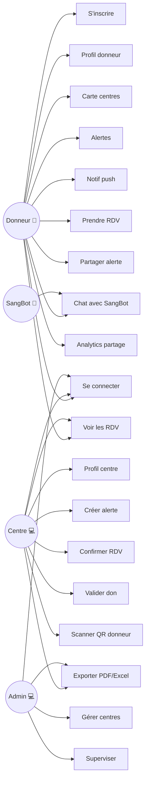
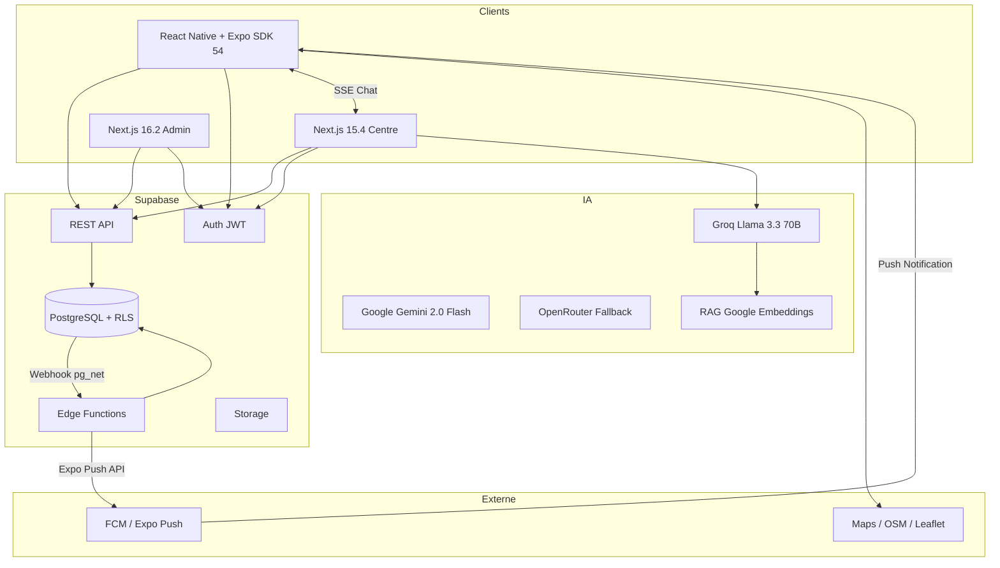
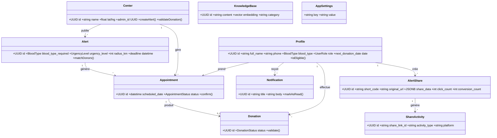
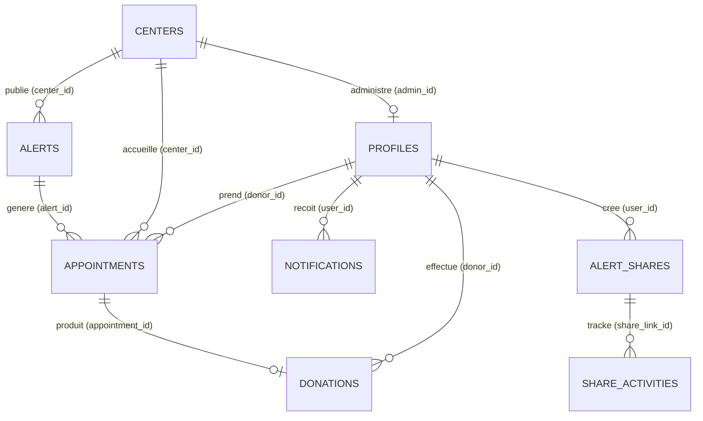
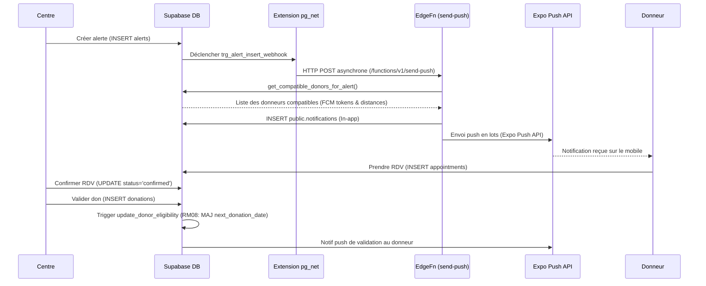

# Cahier des Charges — Projet BloodLink (MVP) v2.2

> Application de mise en relation entre donneurs de sang et centres de dons.

---

## 1. Informations générales

| Rubrique | Détail |
|---|---|
| **Nom du projet** | BloodLink |
| **Type** | Application mobile (donneur) + interface web centre + interface web super admin |
| **Durée** | 6 semaines (1,5 mois) |
| **Rythme** | 3 jours par semaine |
| **Mode** | Collaboratif — pair programming rotatif, aucun rôle figé |
| **Livrable** | MVP fonctionnel, déployable et démontrable |
| **Version** | 2.2 (refonte stack technique, RAG IA & push automatique) |

### 1.1. Équipe

| # | Nom | Rôle |
|---|---|---|
| 1 | Somali Nathanaël Edudzi | Membre (pair rotatif) |
| 2 | Béni Ouendo | Membre (pair rotatif) |
| 3 | Fatoumata Sidibé | Membre (pair rotatif) |
| 4 | Assia AZ | Membre (pair rotatif) |
| 5 | Souhaila Omri | Membre (pair rotatif) |

---

## 2. Contexte et problématique

Le don de sang souffre de :
- **Manque d'information en temps réel** pour les donneurs
- **Difficulté pour les centres** à mobiliser des donneurs compatibles
- **Absence de canal direct** entre centre et donneurs
- **Processus de rendez-vous manuel**, peu structuré
- **Aucun suivi numérique** des dons et de l'éligibilité

BloodLink propose une plateforme qui met en relation les **donneurs** (mobile), les **centres** (web) via un **système d'alertes ciblées, de rendez-vous et de suivi des dons**.

---

## 3. Objectifs du MVP

### 3.1. Objectif général

> Un centre lance une alerte → le système trouve les donneurs compatibles → le donneur est notifié → il prend rendez-vous → le centre confirme → le don est validé → le profil du donneur est mis à jour.

### 3.2. Objectifs spécifiques

- **O1** — Inscription et connexion sécurisée
- **O2** — Gestion de profil centre
- **O3** — Création d'alertes urgentes ciblées
- **O4** — Notification automatique des donneurs compatibles
- **O5** — Prise et gestion de rendez-vous
- **O6** — Validation d'un don + mise à jour éligibilité
- **O7** — Supervision admin minimale

---

## 4. Périmètre du MVP

### 4.1. Inclus

- Auth Supabase Auth (email + JWT)
- Profils donneur et centre
- Alertes urgentes + matching
- Notifications push FCM (expo-notifications)
- Rendez-vous
- Validation don + éligibilité auto
- Dashboard admin minimal
- Carte des centres
- RLS sur toutes les tables
- 🆕 Chat IA SangBot (streaming SSE, tool calling, RAG)
- 🆕 Partage d'alertes (liens courts, QR code, analytics)
- 🆕 i18n multilingue (fr/en/de/es) via next-intl
- 🆕 QR code donneur (scan par centre)
- 🆕 Export PDF (certificats, rapports)

### 4.2. Exclu (Post-MVP)

- Gamification, stock sanguin, stats avancées, audit trail, RDV récurrents, paiements

---

## 5. Acteurs

| Acteur | Interface | Description |
|---|---|---|
| **Donneur** | 📱 Mobile | Personne qui donne son sang |
| **Centre (admin)** | 💻 Web (center_web) | Structure qui collecte le sang |
| **Super admin** | 💻 Web (admin_web) | Superviseur plateforme |
| **SangBot** | 🤖 IA (center_web) | Assistant conversationnel pour le don de sang |
| **Système** | Edge Functions + Triggers | Matching, notifications, règles métier |
| **FCM** | Externe | Notifications push |
| **Supabase** | Externe | Backend as a Service |

---

## 6. Règles métier

| Code | Règle |
|---|---|
| **RM01** | Délai de 56 jours entre deux dons (Norme US / Croix-Rouge; Note : la réglementation marocaine du CNTS exige un délai de carence de 60 jours pour les hommes et 90 jours pour les femmes, ce qui constitue une cible d'évolution post-MVP après l'ajout de l'attribut genre) |
| **RM02** | Donneur ≥ 18 ans et ≥ 50 kg |
| **RM03** | Centre créé par super admin uniquement |
| **RM04** | Alerte expire automatiquement après deadline |
| **RM05** | Matching = groupe compatible + rayon + éligibilité |
| **RM06** | RDV sur créneau futur uniquement |
| **RM07** | Seul le centre valide un don |
| **RM08** | Après validation don → `next_donation_date` +56 jours (trigger; Note : cible d'évolution de 60/90 jours selon le genre post-MVP) |
| **RM09** | Utilisateur désactivé ne peut plus se connecter |
| **RM10** | Mots de passe gérés par Supabase Auth (hash auto) |
| **RM11** | RLS activée sur toutes les tables |

### Compatibilité groupes sanguins

| Donneur | Peut donner à |
|---|---|
| `O-` | Tous |
| `O+` | O+, A+, B+, AB+ |
| `A-` | A-, A+, AB-, AB+ |
| `A+` | A+, AB+ |
| `B-` | B-, B+, AB-, AB+ |
| `B+` | B+, AB+ |
| `AB-` | AB-, AB+ |
| `AB+` | AB+ |

---

## 7. Use Cases

| Code | Nom | Acteur | Interface |
|---|---|---|---|
| UC01 | S'inscrire donneur | Donneur | Mobile |
| UC02 | Se connecter | Tous | Mobile + Web |
| UC03 | Se déconnecter | Tous | Mobile + Web |
| UC04 | Gérer profil donneur | Donneur | Mobile |
| UC05 | Gérer profil centre | Centre | Web |
| UC06 | Voir carte des centres | Donneur | Mobile |
| UC07 | Créer alerte urgente | Centre | Web |
| UC08 | Voir alertes actives | Donneur | Mobile |
| UC09 | Recevoir notif alerte | Donneur | Mobile (push) |
| UC10 | Prendre RDV | Donneur | Mobile |
| UC11 | Voir ses RDV | Donneur/Centre | Mobile + Web |
| UC12 | Confirmer/annuler RDV | Centre | Web |
| UC13 | Valider un don | Centre | Web |
| UC14 | Gérer comptes centres | Admin | Web |
| UC15 | Superviser plateforme | Admin | Web |
| UC16 | Chat avec SangBot | Donneur | Mobile |
| UC17 | Partager une alerte | Donneur | Mobile |
| UC18 | Voir analytics partage | Donneur | Mobile |
| UC19 | Scanner QR donneur | Centre | Web |
| UC20 | Exporter PDF | Centre/Admin | Web |

### Diagramme des cas d'utilisation



### Spécifications détaillées

#### UC01 — S'inscrire donneur
- **Précondition** : Pas de compte existant
- **Scénario** : Saisir email, mot de passe, nom, date naissance, groupe sanguin, poids, téléphone → `supabase.auth.signUp()` → trigger crée profil → redirection accueil
- **Exceptions** : Email utilisé, âge/poids insuffisant (RM02), champs manquants

#### UC02 — Se connecter
- **Scénario** : Email + mot de passe → `supabase.auth.signInWithPassword()` → JWT + session → redirection selon rôle (donor/center_admin/super_admin)
- **Exceptions** : Identifiants incorrects, compte désactivé (RM09)

#### UC07 — Créer alerte urgente
- **Scénario** : Centre saisit groupe sanguin, urgence, rayon, deadline, message → `supabase.from('alerts').insert()` → Webhook Supabase déclenche `send-push` (Edge Function) → push aux donneurs compatibles (via Expo/FCM)
- **Exceptions** : Date passée, rayon ≤ 0

#### UC10 — Prendre RDV
- **Précondition** : Donneur éligible (RM01)
- **Scénario** : Choisir centre + date/heure → `supabase.from('appointments').insert()` (pending) → notif centre
- **Exceptions** : Non éligible, créneau passé (RM06)

#### UC13 — Valider don
- **Précondition** : RDV confirmé
- **Scénario** : Centre valide → `donations` insert (validated) → trigger MAJ `next_donation_date` (+56j) → notif donneur

---

## 8. Exigences non-fonctionnelles

| Code | Exigence |
|---|---|
| NF01 | Auth via Supabase Auth (JWT auto, refresh token) |
| NF02 | RLS sur toutes les tables |
| NF03 | API < 500ms pour 95% des requêtes |
| NF04 | Mobile Android API 24+ via Expo |
| NF05 | Git : `main` / `pre-prod` / `feature/*` |
| NF06 | Données protégées par RLS selon rôle |
| NF07 | Géolocalisation DECIMAL (PostGIS post-MVP) |
| NF08 | Edge Functions via Supabase CLI |
| NF09 | Clés API jamais commitées |
| NF10 | Dashboard admin responsive |

---

## 9. Architecture technique

### 9.1. Stack v2.0

| Couche | Technologie |
|---|---|
| App mobile | React Native + Expo SDK 54 + NativeWind (Tailwind) |
| Web centre | Next.js 15.4 + TypeScript + Tailwind 4 + shadcn/ui |
| Web admin | Next.js 16.2 + TypeScript + Tailwind 4 + shadcn/ui |
| Backend/DB | Supabase (PostgreSQL, Auth, RLS, Edge Functions, Storage) |
| IA Chat | Vercel AI SDK v6 + Groq (Llama 3.3 70B) + RAG (Google embeddings) |
| State mobile | Zustand |
| Push | expo-notifications + Firebase FCM |
| Cartes mobile | react-native-maps |
| Cartes admin | Leaflet + react-leaflet |
| i18n | next-intl (fr/en/de/es) |
| Animations | Framer Motion + GSAP |
| Export | jspdf + @react-pdf/renderer + exceljs |
| QR Code | react-native-qrcode-svg + jsQR + @zxing |
| Déploiement mobile | EAS Build (Expo) |
| Déploiement web | Vercel |
| Versionning | Git + GitHub |

### 9.2. Diagramme d'architecture



### 9.3. Structure projet

```
Boold_link/
├── mobile_app/          # React Native + Expo SDK 54 + NativeWind
│   ├── app/             # Expo Router (auth, tabs, modals)
│   ├── components/      # UI, AI chat, profile, screens
│   ├── services/        # Supabase, alerts, appointments, push, map, dashboard
│   ├── hooks/           # Custom hooks
│   ├── supabase/        # Migrations SQL (7 migrations)
│   └── constants/       # Thème, config
├── center_web/          # Next.js 15.4 — Dashboard Centre + IA Chat
│   └── src/
│       ├── app/         # App Router [locale]/(auth), (dashboard), api/chat
│       ├── components/  # 53 composants shadcn/ui
│       ├── features/    # ai, alerts, appointments, auth, center-dashboard, donations, donors, notifications
│       ├── entities/    # alert, appointment, center, donation, donor
│       ├── shared/      # i18n (fr/en/de/es), supabase, auth, utils, types
│       └── middleware.ts
├── admin_web/           # Next.js 16.2 — Dashboard Super Admin
│   └── src/
│       ├── app/         # admin/*, login, register, reset-password
│       ├── components/  # UI shadcn
│       ├── features/    # alerts, appointments, auth, centers, dashboard, donations, notifications, profiles
│       └── middleware.ts
├── supabase/            # Backend (si migrations centralisées)
└── docs/                # Documentation
```

---

## 10. Modèle de données

### Enums

| Enum | Valeurs |
|---|---|
| `user_role` | donor, center_admin, super_admin |
| `blood_type` | A+, A-, B+, B-, AB+, AB-, O+, O- |
| `urgency_level` | low, medium, high, critical |
| `alert_status` | active, expired, closed |
| `appointment_status` | pending, confirmed, cancelled, completed |
| `donation_status` | pending, validated, rejected |
| `notification_type` | alert, appointment, donation, system |

### Table profiles

| Champ | Type | Contraintes |
|---|---|---|
| id | UUID | PK, FK → auth.users |
| full_name | VARCHAR(200) | NOT NULL |
| phone | VARCHAR(20) | NOT NULL |
| blood_type | ENUM | NULLABLE |
| date_of_birth | DATE | NULLABLE |
| weight_kg | DECIMAL(5,2) | CHECK ≥ 50 |
| role | ENUM user_role | DEFAULT donor |
| is_active | BOOLEAN | DEFAULT TRUE |
| next_donation_date | DATE | NULLABLE |
| fcm_token | VARCHAR(255) | NULLABLE |
| latitude/longitude | DECIMAL | NULLABLE |
| created_at/updated_at | TIMESTAMPTZ | DEFAULT NOW() |

### Table centers

| Champ | Type | Contraintes |
|---|---|---|
| id | UUID | PK |
| name | VARCHAR(200) | NOT NULL |
| address | TEXT | NOT NULL |
| city | VARCHAR(100) | NOT NULL |
| phone/email | VARCHAR | NOT NULL |
| latitude/longitude | DECIMAL | NOT NULL |
| admin_id | UUID | UNIQUE FK → profiles |
| is_active | BOOLEAN | DEFAULT TRUE |

### Table alerts

| Champ | Type | Contraintes |
|---|---|---|
| id | UUID | PK |
| center_id | UUID | FK → centers |
| blood_type_required | ENUM | NOT NULL |
| urgency_level | ENUM | NOT NULL |
| radius_km | INTEGER | CHECK > 0 |
| message | TEXT | NULLABLE |
| deadline | TIMESTAMPTZ | NOT NULL |
| status | ENUM | DEFAULT active |

### Table appointments

| Champ | Type | Contraintes |
|---|---|---|
| id | UUID | PK |
| donor_id | UUID | FK → profiles |
| center_id | UUID | FK → centers |
| alert_id | UUID | FK NULLABLE → alerts |
| scheduled_date | TIMESTAMPTZ | CHECK > NOW() |
| status | ENUM | DEFAULT pending |

### Table donations

| Champ | Type | Contraintes |
|---|---|---|
| id | UUID | PK |
| donor_id/center_id | UUID | FK |
| appointment_id | UUID | FK NULLABLE |
| donation_date | TIMESTAMPTZ | NOT NULL |
| volume_ml | INTEGER | DEFAULT 450 |
| status | ENUM | DEFAULT pending |
| validated_by | UUID | FK NULLABLE |

### Table notifications

| Champ | Type | Contraintes |
|---|---|---|
| id | UUID | PK |
| user_id | UUID | FK → profiles |
| title/body | VARCHAR/TEXT | NOT NULL |
| type | ENUM | NOT NULL |
| is_read | BOOLEAN | DEFAULT FALSE |
| data | JSONB | NULLABLE |

### Table alert_shares 🆕

| Champ | Type | Contraintes |
|---|---|---|
| id | UUID | PK |
| short_code | VARCHAR(8) | UNIQUE NOT NULL |
| original_url | TEXT | NOT NULL |
| share_data | JSONB | NOT NULL |
| user_id | UUID | FK → auth.users |
| expires_at | TIMESTAMPTZ | NOT NULL |
| click_count | INTEGER | DEFAULT 0 |
| conversion_count | INTEGER | DEFAULT 0 |

### Table share_activities 🆕

| Champ | Type | Contraintes |
|---|---|---|
| id | UUID | PK |
| share_link_id | VARCHAR(8) | FK → alert_shares |
| activity_type | VARCHAR(20) | CHECK IN ('share','click','conversion') |
| platform | VARCHAR(50) | NULLABLE |
| user_agent | TEXT | NULLABLE |
| ip_address | INET | NULLABLE |

### Table knowledge_base 🆕

| Champ | Type | Contraintes |
|---|---|---|
| id | UUID | PK |
| content | TEXT | NOT NULL |
| embedding | VECTOR(768) | NOT NULL |
| category | VARCHAR(100) | NULLABLE |
| source | VARCHAR(200) | NULLABLE |
| metadata | JSONB | NULLABLE |

---

## 11. Diagramme UML



---

## 12. Schéma relationnel (MCD)



---

## 13. Diagramme de séquence (scénario principal)



---

## 14. RLS Policies

| Table | Donneur | Centre Admin | Super Admin |
|---|---|---|---|
| profiles | ALL (propre) | SELECT | ALL |
| centers | SELECT | ALL (propre) | ALL |
| alerts | SELECT | ALL (propre centre) | ALL |
| appointments | ALL (propre) | ALL (propre centre) | SELECT |
| donations | SELECT (propre) | ALL (propre centre) | SELECT |
| notifications | ALL (propre) | - | SELECT |

---

## 15. Edge Functions

| Function | Description | Auth |
|---|---|---|
| match-alerts | Alertes compatibles pour donneur | JWT donor |
| check-eligibility | Vérifie éligibilité RDV | JWT donor |
| create-center | Crée compte centre | JWT super_admin |
| send-push | Envoie push Expo/FCM aux donneurs compatibles (via Webhook) | Webhook (service_role) |
| admin-stats | Stats dashboard admin | JWT super_admin |
| expire-alerts | Marque alertes dépassées (cron) | service_role |
| get_nearby_centers | Centres proches d'une position | JWT |
| get_urgent_alerts | Alertes urgentes actives | JWT |

---

## 15b. IA Chat — SangBot 🆕

### Architecture

| Composant | Fichier | Rôle |
|---|---|---|
| API Route | `center_web/src/app/api/chat/route.ts` | SSE streaming, JWT auth, RAG context, tool calls |
| Modèles | `center_web/src/features/ai/lib/models.ts` | Groq (primary) → Gemini → OpenRouter (fallback) |
| Prompt | `center_web/src/features/ai/lib/prompts.ts` | System prompt SangBot, contexte utilisateur |
| RAG | `center_web/src/features/ai/lib/rag.ts` | Google embeddings + Supabase `match_knowledge` RPC |
| Tools | `center_web/src/features/ai/lib/tools.ts` | `getNearbyCenters`, `getUrgentAlerts` |
| Hook mobile | `mobile_app/components/ai/useChat.ts` | SSE parsing, state management, abort, erreurs |
| Chat UI | `mobile_app/components/ai/ChatDrawer.tsx` | Drawer modal, messages, suggestions |
| Input | `mobile_app/components/ai/ChatInput.tsx` | Text input, send, stop button |
| Message | `mobile_app/components/ai/ChatMessage.tsx` | Bulles user/assistant, avatar |
| Widget | `mobile_app/components/ai/ChatWidget.tsx` | Bouton flottant, ouverture drawer |

### Flux de données

```
Mobile (useChat) ──POST──► /api/chat ──► JWT verify
                                    ──► RAG search (5s timeout)
                                    ──► Build system prompt
                                    ──► streamText (Groq/Gemini/OpenRouter)
                                    ──► Tool calls (getNearbyCenters, getUrgentAlerts)
                                    ──► SSE stream ──► Mobile
```

### Modèles IA (priorité)

| Priorité | Provider | Modèle | Quota gratuit |
|---|---|---|---|
| 1 | Groq | llama-3.3-70b-versatile | 14400 req/jour |
| 2 | Google Gemini | gemini-2.0-flash | 1500 req/jour |
| 3 | OpenRouter | nvidia/nemotron-3-super-120b-a4b:free | Limité |

---

## 16. Méthodologie

### Rotation des pairs

| Semaine | Pair A | Pair B | Review |
|---|---|---|---|
| S1 | Assia + Souhaila | Béni + Nathanaël | Fatoumata |
| S2 | Assia + Nathanaël | Souhaila + Fatoumata | Béni |
| S3 | Souhaila + Béni | Fatoumata + Nathanaël | Assia |
| S4 | Nathanaël + Assia | Souhaila + Fatoumata | Béni |
| S5 | Fatoumata + Béni | Assia + Souhaila | Nathanaël |
| S6 | Tous ensemble | Tous ensemble | - |

### Rituels
- Daily 15min : quoi fait hier, aujourd'hui, blocage ?
- Revue fin de module : démo + rétrospective
- Pair programming : driver change toutes les 30min

### Règles Git
- Branches : `main`, `pre-prod`, `feature/<nom>`
- Revue de code obligatoire avant merge
- Pas de push direct sur `main`/`pre-prod`

---

## 17. Planning

| Semaine | Module | Détail |
|---|---|---|
| S1 | Auth & Setup | Login/Register mobile + web, Supabase Auth, Zustand |
| S2 | Profils | Profil donneur, photo, dashboard centre |
| S3 | Carte & Alertes | Google Maps, création alertes, match-alerts |
| S4 | RDV & Notifs | Prise RDV, push FCM, gestion RDV centre |
| S5 | Dons & Validation | QR code, validation don, stats admin |
| S6 | Tests & Deploy | E2E, corrections, APK, Vercel, doc finale |

> Voir `PLAN_TACHES.md` pour les checklists détaillées.

---

## 18. Livrables

- Code source (mobile + web + supabase) sur GitHub
- Ce document (v2.0)
- `ARCHITECTURE_TECHNIQUE.md`
- `PLAN_TACHES.md`
- `GUIDE_INSTALLATION.md`
- `GUIDE_BONNES_PRATIQUES.md`
- Build Android (APK)
- Dashboard web (Vercel)
- Vidéo démo (5-10 min)

---

## 19. Risques

| Risque | Mitigation |
|---|---|
| Matching complexe (M3) | Version simplifiée sans PostGIS |
| Intégration FCM | Tester dès S2 |
| Coordination | Daily + pair programming |
| Dépendance Maps | Fallback liste centres |
| Absences | Doc continue + pair |
| Apprentissage stack | Pair programming + tutoriels |

---

## 20. Critères d'acceptation

- [ ] Donneur : inscription, connexion, profil
- [ ] Centre : connexion, création alerte
- [ ] Donneurs compatibles reçoivent notification
- [ ] Donneur prend RDV
- [ ] Centre confirme RDV
- [ ] Centre valide don
- [ ] `next_donation_date` MAJ automatique
- [ ] Admin crée/suspend compte centre
- [ ] Bout en bout fonctionnel Android + web
- [ ] RLS active et testée
- [ ] 🆕 Chat SangBot fonctionnel (streaming, tool calls)
- [ ] 🆕 Partage d'alertes (lien court, QR, analytics)
- [ ] 🆕 i18n multilingue (fr/en/de/es)
- [ ] 🆕 QR code donneur scannable par centre
- [ ] 🆕 Export PDF fonctionnel

---

## 21. Annexes

### Conventions
- Branches : `main`, `pre-prod`, `feature/<module>`, `fix/<sujet>`
- Commits : `type(scope): message` (ex : `feat(auth): login screen`)
- Code : ESLint + Prettier

### Glossaire

| Terme | Définition |
|---|---|
| MVP | Minimum Viable Product |
| JWT | JSON Web Token |
| FCM | Firebase Cloud Messaging |
| RLS | Row Level Security |
| Edge Function | Fonction serveur Deno (Supabase) |
| EAS | Expo Application Services |
| SSE | Server-Sent Events (streaming IA) |
| RAG | Retrieval-Augmented Generation |
| SangBot | Assistant IA BloodLink pour le don de sang |
| NativeWind | Tailwind CSS pour React Native |
| shadcn/ui | Librairie composants React basée sur Radix UI |

---

*Fin du cahier des charges BloodLink v2.2 — MVP 6 semaines.*
*Dernière mise à jour : 2026-05-24 (Analyse complète des 3 apps, intégration RAG IA et push via pg_net)*
